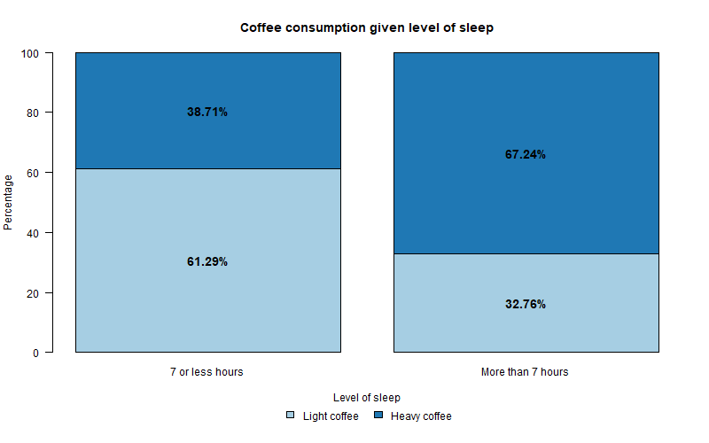

# Module 1

<!-- ====== COLOURED BANNER ====== -->
```{=html}
<div style="
  background: linear-gradient(90deg, #e6f0ff, #f7fbff);
  border-left: 8px solid #2a7ae2;
  padding: 22px;
  margin-bottom: 30px;
  border-radius: 6px;
">
  <h2 style="margin-top:0; color:#1a4f8b; font-weight:700;">
    Module Focus:
  </h2>
  <p style="font-size:1.05em; margin-bottom:0;">
    One line summary

In this module, we look at how graphs can be used and misused, learn to classify variables by data type, summarise and display single variables with the appropriate graph, and use contingency tables to explore the association between two categorical variables.
  </p>
</div>
```
<!-- ====== END BANNER ====== -->


## Use, Abuse, and Misuse of Statistics

Statistics are powerful, but they can be misleading if used poorly or dishonestly.

**Key ideas**

- Results can be **misinterpreted** through poor sampling or misleading summaries.
- Graphs can strongly influence interpretation depending on:
  - scale and axis limits
  - graph type
  - use of 3D effects or distorted perspectives

**Good data visualisation principles**

- Match the graph type to the **data type**
- Label axes clearly (variable names and units)
- Use honest scales (usually starting at zero)
- Avoid unnecessary decoration (especially 3D graphs)
- Aim to **tell the truth** and communicate clearly


A graph is only as good as the data it displays. No amount of visual design can fix poor or biased data.


---

## Variables and Types of Data

Understanding data begins with understanding variables.

**Statistical terminology**

- **Cases**: the individuals or objects being studied
- **Variables**: characteristics measured on each case
- **Data**: the observed values of the variables

**Types of data**

| Data type | Description | Examples |
|---------|------------|----------|
| Quantitative | Numerical values with meaningful units | Height (cm), pulse rate |
| Categorical (Categorical) | Categories with no natural order | Gender, faculty |
| Ordinal | Categories with a natural order | Likert scale responses |
| Identifier | Unique labels for each case | Student number |

Categorical variables are often **coded numerically** in software, but the numbers themselves have no numerical meaning.

---

## Summarising and Displaying One Variable

The **distribution of a variable** describes what values it takes and how often they occur.

**Numerical summaries**

- Frequency tables for categorical variables
- Frequency distributions for quantitative variables

**Graphical summaries**

| Data type | Appropriate graphs |
|---------|-------------------|
| Categorical | Bar chart, Pie chart |
| Quantitative | Histogram, Stem-and-leaf plot, Boxplot |

**Bar charts**

- Used for **categorical variables**
- Bars do **not** touch
- Order bars logically (alphabetical or by size)

**Pie charts**

- Not recommended as difficult for the reader to fully understand
- Show **parts of a whole**
- Must include all categories (total = 100%)
- Best used sparingly and with few categories

---

## Interactive Activity: Variable Types and Graphs {-}

```{=html}
<style>
  .vg-wrap{max-width:900px;margin:0 auto;}
  .vg-card{border:1px solid #e5e5e5;border-radius:6px;padding:16px;background:#fff;margin:14px 0;}
  .vg-card h4{margin:.2rem 0 .5rem;font-size:1.05rem;color:#1a4f8b;}
  .vg-note{font-size:.9rem;color:#666;margin-bottom:.6rem;}
  .vg-tray{display:flex;flex-wrap:wrap;gap:8px;min-height:46px;padding:10px;border:1px dashed #bbb;border-radius:6px;background:#fafafa;margin-bottom:14px;}
  .vg-item{padding:8px 12px;border:1px solid #2a7ae2;border-radius:16px;background:#eaf2ff;color:#1a4f8b;font-size:.92rem;cursor:grab;user-select:none;}
  .vg-item.selected{background:#2a7ae2;color:#fff;box-shadow:0 0 0 2px #1a4f8b;}
  .vg-item.correct{background:#e3f7e6;border-color:#2e8b45;color:#1e5b2c;}
  .vg-item.incorrect{background:#fdeaea;border-color:#c0392b;color:#8a2418;}
  .vg-bins{display:grid;grid-template-columns:repeat(auto-fit,minmax(180px,1fr));gap:10px;margin-bottom:10px;}
  .vg-bin h5{margin:0 0 6px;font-size:.95rem;text-align:center;color:#333;}
  .vg-drop{min-height:90px;border:2px dashed #9bbbe8;border-radius:6px;background:#f5f9ff;padding:8px;display:flex;flex-wrap:wrap;gap:6px;align-content:flex-start;}
  .vg-drop.dragover{background:#e3edfc;border-color:#2a7ae2;}
  .vg-controls{display:flex;gap:8px;flex-wrap:wrap;margin-top:8px;}
  .vg-btn{padding:6px 10px;border:1px solid #ccc;border-radius:4px;background:#f7f7f7;cursor:pointer;}
  .vg-result{margin-top:8px;font-weight:600;}
</style>

<div class="vg-wrap">

  <div class="vg-card">
    <h4>Step 1: Classify Each Variable</h4>
    <p class="vg-note">
      Drag each variable card into the box describing its data type.
      On a touch device, tap a variable then tap a box to place it.
    </p>

    <div id="vg1">
      <div class="vg-tray">
        <div class="vg-item" draggable="true" data-id="e1v1" data-answer="Quantitative">Height (cm)</div>
        <div class="vg-item" draggable="true" data-id="e1v2" data-answer="Categorical">Eye colour</div>
        <div class="vg-item" draggable="true" data-id="e1v3" data-answer="Ordinal">Course satisfaction (Poor to Excellent)</div>
        <div class="vg-item" draggable="true" data-id="e1v4" data-answer="Identifier">Student ID number</div>
        <div class="vg-item" draggable="true" data-id="e1v5" data-answer="Quantitative">Resting pulse rate</div>
        <div class="vg-item" draggable="true" data-id="e1v6" data-answer="Categorical">Faculty enrolled in</div>
      </div>

      <div class="vg-bins">
        <div class="vg-bin"><h5>Quantitative</h5><div class="vg-drop" data-bin="Quantitative"></div></div>
        <div class="vg-bin"><h5>Categorical</h5><div class="vg-drop" data-bin="Categorical"></div></div>
        <div class="vg-bin"><h5>Ordinal</h5><div class="vg-drop" data-bin="Ordinal"></div></div>
        <div class="vg-bin"><h5>Identifier</h5><div class="vg-drop" data-bin="Identifier"></div></div>
      </div>

      <div class="vg-controls">
        <button class="vg-btn" data-action="check">Check answers</button>
        <button class="vg-btn" data-action="show">Show answers</button>
        <button class="vg-btn" data-action="reset">Reset</button>
      </div>
      <div class="vg-result" id="vg1-result"></div>
    </div>
  </div>

  <div class="vg-card">
    <h4>Step 2: Choose the Right Graph</h4>
    <p class="vg-note">
      Now drag each variable into the box for the graph type that would best display it.
    </p>

    <div id="vg2">
      <div class="vg-tray">
        <div class="vg-item" draggable="true" data-id="e2v1" data-answer="Quant">Height (cm)</div>
        <div class="vg-item" draggable="true" data-id="e2v2" data-answer="Cat">Eye colour</div>
        <div class="vg-item" draggable="true" data-id="e2v3" data-answer="Cat">Course satisfaction (Poor to Excellent)</div>
        <div class="vg-item" draggable="true" data-id="e2v4" data-answer="None">Student ID number</div>
        <div class="vg-item" draggable="true" data-id="e2v5" data-answer="Quant">Resting pulse rate</div>
        <div class="vg-item" draggable="true" data-id="e2v6" data-answer="Cat">Faculty enrolled in</div>
        <div class="vg-item" draggable="true" data-id="e2v7" data-answer="None">Postcode</div>
      </div>

      <div class="vg-bins">
        <div class="vg-bin"><h5>Bar chart / Pie chart<br>(Categorical)</h5><div class="vg-drop" data-bin="Cat"></div></div>
        <div class="vg-bin"><h5>Histogram / Boxplot<br>(Quantitative)</h5><div class="vg-drop" data-bin="Quant"></div></div>
        <div class="vg-bin"><h5>Not usually graphed<br>directly (Identifier)</h5><div class="vg-drop" data-bin="None"></div></div>
      </div>

      <div class="vg-controls">
        <button class="vg-btn" data-action="check">Check answers</button>
        <button class="vg-btn" data-action="show">Show answers</button>
        <button class="vg-btn" data-action="reset">Reset</button>
      </div>
      <div class="vg-result" id="vg2-result"></div>
    </div>
  </div>

</div>

<script>
(function(){
  function setupDragMatch(containerId, resultId){
    const root  = document.getElementById(containerId);
    const tray  = root.querySelector('.vg-tray');
    const drops = Array.from(root.querySelectorAll('.vg-drop'));
    const items = Array.from(root.querySelectorAll('.vg-item'));
    const result = document.getElementById(resultId);
    let selected = null;

    function clearFeedback(){
      items.forEach(it => it.classList.remove('correct','incorrect'));
      result.textContent = '';
    }

    function placeInBin(item, bin){
      bin.appendChild(item);
      item.classList.remove('selected');
    }

    items.forEach(item => {
      item.addEventListener('dragstart', e => {
        e.dataTransfer.setData('text/plain', item.dataset.id);
      });

      item.addEventListener('click', () => {
        if (selected === item) {
          item.classList.remove('selected');
          selected = null;
          return;
        }
        items.forEach(i => i.classList.remove('selected'));
        item.classList.add('selected');
        selected = item;
      });
    });

    [tray, ...drops].forEach(target => {
      target.addEventListener('dragover', e => {
        e.preventDefault();
        target.classList.add('dragover');
      });
      target.addEventListener('dragleave', () => target.classList.remove('dragover'));
      target.addEventListener('drop', e => {
        e.preventDefault();
        target.classList.remove('dragover');
        const id = e.dataTransfer.getData('text/plain');
        const item = root.querySelector(`[data-id="${id}"]`);
        if (item) placeInBin(item, target);
        clearFeedback();
      });
      target.addEventListener('click', () => {
        if (selected) {
          placeInBin(selected, target);
          selected = null;
          clearFeedback();
        }
      });
    });

    root.querySelector('[data-action="check"]').addEventListener('click', () => {
      let correct = 0;
      items.forEach(item => {
        item.classList.remove('correct','incorrect');
        const bin = item.closest('.vg-drop');
        if (bin && bin.dataset.bin === item.dataset.answer) {
          item.classList.add('correct');
          correct++;
        } else {
          item.classList.add('incorrect');
        }
      });
      result.textContent = `Score: ${correct} of ${items.length}`;
    });

    root.querySelector('[data-action="show"]').addEventListener('click', () => {
      items.forEach(item => {
        const bin = drops.find(d => d.dataset.bin === item.dataset.answer);
        if (bin) placeInBin(item, bin);
        item.classList.remove('correct','incorrect');
      });
      result.textContent = 'Answers shown.';
    });

    root.querySelector('[data-action="reset"]').addEventListener('click', () => {
      items.forEach(item => {
        tray.appendChild(item);
        item.classList.remove('correct','incorrect','selected');
      });
      selected = null;
      result.textContent = '';
    });
  }

  setupDragMatch('vg1', 'vg1-result');
  setupDragMatch('vg2', 'vg2-result');
})();
</script>
```

---

## Contingency Tables (Two Categorical Variables)

When analysing **two categorical variables**, we use a **contingency table** (also called a two-way table or cross-tabulation).

**Types of distributions**

- **Joint distribution**: proportions of all cases in each cell
- **Marginal distribution**: proportions for one variable only (row or column totals)
- **Conditional distribution**: proportions within a subgroup

**Assessing association**

Two categorical variables are **associated** if the conditional distributions differ between groups. If the conditional distributions are similar, the variables are considered **independent**.

**Graphical support**

- **Stacked bar charts** are useful for comparing conditional distributions visually.

::: {.callout-important}
To assess association, always compare **conditional distributions**, not just raw counts.
:::

---

# Review Questions: Module 1 {-}

```{=html}
<div style="
  background: #f0f7ff;
  border-left: 6px solid #2a7ae2;
  padding: 18px;
  margin: 25px 0;
  border-radius: 6px;
">
  <p style="margin:0; font-size:1.05em;">
    Once you have watched the lecture recordings you should be able to answer the following 
    <em>Threshold</em> questions (solutions can be found at the end of this Workbook).
  </p>
</div>
```

```{=html}
<style>
  .revq { max-width:900px; margin:0 auto; }
  .revq .muted { color:#666; font-size:.9rem; }
  .revq-row { display:grid; grid-template-columns: 1fr 120px; gap:10px; align-items:start; margin:.6rem 0; }
  .revq textarea { width:100%; min-height:3.2rem; padding:6px; box-sizing:border-box; }
  .revq .chk { display:flex; align-items:center; gap:.5rem; }
  .revq .btn { padding:6px 10px; border:1px solid #ccc; border-radius:4px; background:#f7f7f7; cursor:pointer; }
  .revq .btn + .btn { margin-left:.4rem; }
  .revq-answers { background:#f6fbff; border-left:6px solid #2b8cbe; padding:.9rem 1rem; border-radius:6px; margin-top:.8rem; display:none; }
  .revq-answers h5 { margin:.2rem 0 .5rem; font-size:1.05rem; }
  .revq-answers p { margin:.4rem 0; }
</style>

<div class="revq" id="revq">
  <p class="muted">
    Write your answers in the boxes below. Tick the checkbox if you believe your answer is correct.
    Click <em>Show model answers</em> to compare.
  </p>

  (i) What is a variable? What is a value of a variable? Give examples.</strong>
  <div class="revq-row">
    <textarea id="revq_m1_q1"
        placeholder="Your answer…"></textarea>
    <label class="chk"><input type="checkbox"> Marked correct</label>
  </div>

  (ii) How can we tell if a variable is quantitative, categorical, ordinal, or an identifier?</strong>
  <div class="revq-row">
    <textarea id="revq_m1_q2"
    placeholder="Your answer…"></textarea>
    <label class="chk"><input type="checkbox"> Marked correct</label>
  </div>

  (iii) What is a contingency (two‑way) table? When is it used?</strong>
  <div class="revq-row">
    <textarea id="revq_m1_q3"
    placeholder="Your answer…"></textarea>
    <label class="chk"><input type="checkbox"> Marked correct</label>
  </div>

  (iv) What is meant by marginal, joint, and conditional distributions?</strong>
  <div class="revq-row">
    <textarea id="revq_m1_q4"
    placeholder="Your answer…"></textarea>
    <label class="chk"><input type="checkbox"> Marked correct</label>
  </div>

  <div style="margin-top:.6rem;">
    <button class="btn" id="revq-show">Show model answers</button>
    <button class="btn" id="revq-hide" style="display:none;">Hide model answers</button>
    <button class="btn" id="revq-reset">Reset</button>
  </div>

  <div class="revq-answers" id="revq-model">
    <h5>Model answers</h5>

    <p><strong>(i)</strong> A <em>variable</em> is any characteristic of a case (an individual or object being described).
    A <em>value</em> of a variable is the observed measurement or category for that case.
    For example, for the variable <em>height</em>, values are measurements in centimetres or metres.
    For <em>country of origin</em>, values may be Australia or Not Australia.</p>

    <p><strong>(ii)</strong>
    Quantitative variables takes on numerical values for which mathematical operations (like +, ÷) make sense, has a unit of measurement
    Categorical variables are defined by categories.
    Ordinal variables are categorical with a natural/set order.
    Identifiers uniquely label each case.</p>

    <p><strong>(iii)</strong>
    A contingency (two-way) table is a visual representation of data which shows the distribution of individuals along two categorical variables.</p>

    <p><strong>(iv)</strong>
    A marginal distribution describes proportion of individuals in the table located in one particular row or column.
    A joint distribution describes the proportion of individuals in the table located in one particular cell.
    A conditional distribution describes the proportion of individuals in a row/column located in one particular cell.</p>
  </div>
</div>

<script>
(function(){
  const show = document.getElementById("revq-show");
  const hide = document.getElementById("revq-hide");
  const model = document.getElementById("revq-model");
  const reset = document.getElementById("revq-reset");

  show.onclick = () => { model.style.display="block"; show.style.display="none"; hide.style.display="inline-block"; };
  hide.onclick = () => { model.style.display="none"; hide.style.display="none"; show.style.display="inline-block"; };
  reset.onclick = () => {
    document.querySelectorAll("#revq textarea").forEach(t => t.value="");
    document.querySelectorAll("#revq input[type=checkbox]").forEach(c => c.checked=false);
    model.style.display="none"; hide.style.display="none"; show.style.display="inline-block";
  };
})();
</script>
```

<!--
NOTE FOR FUTURE ME:
This module uses child Rmd files under section headings (##) so that:
- Module 1, Tutorial are in different files but render together
- Summary, Review, and Tutorial are numbered 1.1, 1.2, 1.3
- bs4_book splits these sections into separate HTML pages (via split_by: section)
- PDF output still renders cleanly with correct numbering

DO NOT add this file's children to _bookdown.yml
DO NOT use # headings in the child files
-->


# Tutorial Questions: Module 1 {-}

Note: * Indicates **Expanded** Competencies


## Question 1: Investigating the association between two categorical variables 

*Is there an association between the amount of coffee consumed and the number of hours of sleep students manage to have per night?*

The following data was collected and organized into the Contingency Table (two-way table) below to see if there is an association between amount of coffee consumed
(stated as *3 or less coffees per day (Light)* and *more than 3 coffees per day (Heavy)*) and the number of hours slept per night (stated as *7 or less hours per night* and *more than 7 hours per night*) for 151 statistics students.

Table: Coffee consumption and hours of sleep

|                          | 7 hours or less per night | More than 7 hours per night | Total |
|--------------------------|---------------------------|------------------------------|-------|
| 3 or less coffees per day (Light) | 57 | 19 | 76 |
| More than 3 coffees per day (Heavy) | 36 | 39 | 75 |
| Total                    | 93 | 58 | 151 |

```{=html}
<style>
  .pred-box{max-width:750px;border:1px solid #e5e5e5;border-radius:8px;padding:18px;margin:18px 0;background:linear-gradient(135deg,#fff8e6,#fff);}
  .pred-box p{margin:.3rem 0;}
  .pred-q{font-weight:600;font-size:1.02em;}
  .pred-btns{display:flex;flex-wrap:wrap;gap:8px;margin-top:.6rem;}
  .pred-choice{padding:8px 14px;border:1px solid #e0a800;border-radius:20px;background:#fff3cd;cursor:pointer;font-size:.92rem;}
  .pred-choice:hover{background:#ffe9a8;}
  .pred-locked{margin-top:.6rem;font-size:.95rem;}
  .pred-btn-small{padding:4px 10px;border:1px solid #ccc;border-radius:4px;background:#f7f7f7;cursor:pointer;font-size:.85rem;margin-top:.3rem;}
</style>

<div class="pred-box" id="pred-box">
  <p>☕ 😴 Before you crunch any numbers, go with your gut.</p>
  <p class="pred-q">Do you think students who drink <em>more</em> coffee tend to sleep MORE or LESS than light coffee drinkers?</p>

  <div class="pred-btns" id="pred-btns">
    <button class="pred-choice" data-choice="more">Heavy drinkers sleep MORE</button>
    <button class="pred-choice" data-choice="less">Heavy drinkers sleep LESS</button>
    <button class="pred-choice" data-choice="same">No real difference</button>
  </div>

  <div class="pred-locked" id="pred-locked" style="display:none;">
    🔒 Prediction locked in: <strong id="pred-locked-text"></strong>.
    Work through the questions below, then come back to Q1(g) to see how you did.
    <br>
    <button class="pred-btn-small" id="pred-change">Change my guess</button>
  </div>
</div>

<script>
(function(){
  const KEY = "tut1-prediction";
  const btnsWrap = document.getElementById("pred-btns");
  const locked   = document.getElementById("pred-locked");
  const lockedText = document.getElementById("pred-locked-text");
  const changeBtn = document.getElementById("pred-change");

  const labels = {
    more: "Heavy drinkers sleep MORE",
    less: "Heavy drinkers sleep LESS",
    same: "No real difference"
  };

  function lockIn(choice){
    localStorage.setItem(KEY, choice);
    lockedText.textContent = labels[choice];
    btnsWrap.style.display = "none";
    locked.style.display = "block";
  }

  document.querySelectorAll(".pred-choice").forEach(b => {
    b.addEventListener("click", () => lockIn(b.dataset.choice));
  });

  changeBtn.addEventListener("click", () => {
    localStorage.removeItem(KEY);
    btnsWrap.style.display = "flex";
    locked.style.display = "none";
  });

  const saved = localStorage.getItem(KEY);
  if (saved) lockIn(saved);
})();
</script>
```

### Q1(a){-}
From the data in the study, how many students:

```{=html}
<div class="qa-box">
  <div class="qa-row">
    <label>(i) slept 7 or fewer hours:</label>
    <input type="number" class="qa-in" id="qa1" data-answer="93" />
  </div>

  <div class="qa-row">
    <label>(ii) are Light coffee drinkers:</label>
    <input type="number" class="qa-in" id="qa2" data-answer="76" />
  </div>

  <div class="qa-row">
    <label>(iii) are Heavy coffee drinkers AND 7 or fewer hours per night:</label>
    <input type="number" class="qa-in" id="qa3" data-answer="36" />
  </div>

  <button class="qa-btn" id="qa-check">Check answers</button>
  <button class="qa-btn" id="qa-show">Show answers</button>
  <button class="qa-btn" id="qa-reset">Reset</button>

  <div id="qa-result"></div>
</div>

<script>
(function(){
  function check(){
    let correct = 0, total = 0;

    document.querySelectorAll(".qa-in").forEach(el => {
      total++;
      const user = Number(el.value);
      const key  = Number(el.dataset.answer);

      el.classList.remove("correct","incorrect");
      if (user === key) {
        el.classList.add("correct");
        correct++;
      } else {
        el.classList.add("incorrect");
      }
    });

    document.getElementById("qa-result").textContent =
      `Score: ${correct} of ${total}`;
  }

  function show(){
    document.querySelectorAll(".qa-in").forEach(el => {
      el.value = el.dataset.answer;
      localStorage.setItem(el.id, el.value);   // persist shown answers
      el.classList.remove("correct","incorrect");
    });
    document.getElementById("qa-result").textContent = "Answers shown.";
  }

  function reset(){
    document.querySelectorAll(".qa-in").forEach(el => {
      el.value = "";
      localStorage.removeItem(el.id);          // forget saved value
      el.classList.remove("correct","incorrect");
    });
    document.getElementById("qa-result").textContent = "";
  }

  document.getElementById("qa-check").onclick = check;
  document.getElementById("qa-show").onclick  = show;
  document.getElementById("qa-reset").onclick = reset;
})();
</script>
```

### Q1(b){-}
From the data in the study (for each state if it is a joint, marginal or conditional
percentage (rounded to 1 decimal place) as well as the answer):

```{=html}
<div class="qb2-box">

  <div class="qb2-row">
    <label>(i) Percentage of students who slept 7 or fewer hours:</label>
    <div class="qb2-inline">
      <select class="qb2-type" id="qb2_type_1" data-answer="Marginal">
        <option value="">-- Select --</option>
        <option>Marginal</option>
        <option>Joint</option>
        <option>Conditional</option>
      </select>
      <input type="number"
             class="qb2-in"
             id="qb2_val_1"
             data-answer="61.6"
             placeholder="%" />
    </div>
  </div>

  <div class="qb2-row">
    <label>(ii) Percentage of students who are light coffee drinkers:</label>
    <div class="qb2-inline">
      <select class="qb2-type" id="qb2_type_2" data-answer="Marginal">
        <option value="">-- Select --</option>
        <option>Marginal</option>
        <option>Joint</option>
        <option>Conditional</option>
      </select>
      <input type="number"
             class="qb2-in"
             id="qb2_val_2"
             data-answer="50.3"
             placeholder="%" />
    </div>
  </div>

  <div class="qb2-row">
    <label>(iii) Percentage of heavy coffee drinkers AND sleep 7 or less hours:</label>
    <div class="qb2-inline">
      <select class="qb2-type" id="qb2_type_3" data-answer="Joint">
        <option value="">-- Select --</option>
        <option>Marginal</option>
        <option>Joint</option>
        <option>Conditional</option>
      </select>
      <input type="number"
             class="qb2-in"
             id="qb2_val_3"
             data-answer="23.8"
             placeholder="%" />
    </div>
  </div>

  <div class="qb2-row">
    <label>(iv) Percentage of light coffee drinkers who also sleep 7 or less hours:</label>
    <div class="qb2-inline">
      <select class="qb2-type" id="qb2_type_4" data-answer="Conditional">
        <option value="">-- Select --</option>
        <option>Marginal</option>
        <option>Joint</option>
        <option>Conditional</option>
      </select>
      <input type="number"
             class="qb2-in"
             id="qb2_val_4"
             data-answer="75.0"
             placeholder="%" />
    </div>
  </div>

  <div class="qb2-row">
    <label>(v) Percentage who sleep 7 or less hours are light coffee drinkers:</label>
    <div class="qb2-inline">
      <select class="qb2-type" id="qb2_type_5" data-answer="Conditional">
        <option value="">-- Select --</option>
        <option>Marginal</option>
        <option>Joint</option>
        <option>Conditional</option>
      </select>
      <input type="number"
             class="qb2-in"
             id="qb2_val_5"
             data-answer="61.3"
             placeholder="%" />
    </div>
  </div>

  <button class="qb2-btn" id="qb2-check">Check answers</button>
  <button class="qb2-btn" id="qb2-show">Show answers</button>
  <button class="qb2-btn" id="qb2-reset">Reset</button>

  <div id="qb2-result"></div>
</div>

<script>
(function(){
  function check(){
    let correct = 0, total = 0;

    document.querySelectorAll(".qb2-type").forEach(el => {
      total++;
      const user = el.value;
      const key  = el.dataset.answer;

      el.classList.remove("correct","incorrect");
      if (user === key) {
        el.classList.add("correct");
        correct++;
      } else {
        el.classList.add("incorrect");
      }
    });

    document.querySelectorAll(".qb2-in").forEach(el => {
      total++;
      const user = Number(el.value);
      const key  = Number(el.dataset.answer);

      el.classList.remove("correct","incorrect");
      if (Math.abs(user - key) < 0.2) {
        el.classList.add("correct");
        correct++;
      } else {
        el.classList.add("incorrect");
      }
    });

    document.getElementById("qb2-result").textContent =
      `Score: ${correct} of ${total}`;
  }

  function show(){
    document.querySelectorAll(".qb2-type").forEach(el => {
      el.value = el.dataset.answer;
      localStorage.setItem(el.id, el.value);
      el.classList.remove("correct","incorrect");
    });

    document.querySelectorAll(".qb2-in").forEach(el => {
      el.value = el.dataset.answer;
      localStorage.setItem(el.id, el.value);
      el.classList.remove("correct","incorrect");
    });

    document.getElementById("qb2-result").textContent = "Answers shown.";
  }

  function reset(){
    document.querySelectorAll(".qb2-type, .qb2-in").forEach(el => {
      el.value = "";
      localStorage.removeItem(el.id);
      el.classList.remove("correct","incorrect");
    });

    document.getElementById("qb2-result").textContent = "";
  }

  document.getElementById("qb2-check").onclick = check;
  document.getElementById("qb2-show").onclick  = show;
  document.getElementById("qb2-reset").onclick = reset;
})();
</script>
```

### Q1(c): Joint Distribution {-}
In a two-way table, display the *joint* distribution of level of coffee consumed
and level of sleep in terms of percentages (round to 1 or 2 decimal place).

```{=html}
<div class="pt-box">
  <h3>Fill in the percentage table (percent of all 151 students)</h3>

<table class="pt">
  <tr>
    <th>Coffee / Sleep</th>
    <th>7 hours or less</th>
    <th>More than 7 hours</th>
    <th>Total</th>
  </tr>

  <tr>
    <th>Light drinkers</th>
    <td><input class="pt-in pt-joint" id="pt_1_1" data-answer="37.75" /></td>
    <td><input class="pt-in pt-joint" id="pt_1_2" data-answer="12.25" /></td>
    <td></td>  <!-- blank total -->
  </tr>

  <tr>
    <th>Heavy drinkers</th>
    <td><input class="pt-in pt-joint" id="pt_2_1" data-answer="23.84" /></td>
    <td><input class="pt-in pt-joint" id="pt_2_2" data-answer="25.83" /></td>
    <td></td>  <!-- blank total -->
  </tr>

  <tr>
    <th>Total</th>
    <td></td>  <!-- blank total -->
    <td></td>  <!-- blank total -->
    <td></td>  <!-- blank grand total -->
  </tr>
</table>

  <!-- Action buttons -->
  <button class="pt-btn" id="pt-check">Check answers</button>
  <button class="pt-btn" id="pt-show">Show answers</button>
  <button class="pt-btn" id="pt-reset">Reset</button>
  <button class="pt-btn" id="pt-hint-show">Show hint</button>
  <button class="pt-btn" id="pt-hint-hide" style="display:none;">Hide hint</button>

  <!-- Hint box -->
  <div class="hint-box" id="pt-hint" style="display:none; margin-top:10px;">
    <strong>Hint:</strong>
    A <em>joint percentage</em> is calculated as
    <br>
    <strong>cell total ÷ grand total × 100</strong>.
    <br>
    Answers correct to <em>1 or 2 decimal places</em> are acceptable.
  </div>

  <div id="pt-result"></div>
</div>

<script>
(function(){

  /* ---------- CHECK (joint cells only) ---------- */
  function check(){
    let correct = 0, total = 0;

    document.querySelectorAll(".pt-joint").forEach(el => {
      total++;

      const user = Number(el.value);
      const key  = Number(el.dataset.answer);

      el.classList.remove("correct","incorrect");

      // Accept rounding to 1 or 2 decimal places
      if (!isNaN(user) && Math.abs(user - key) < 0.05) {
        el.classList.add("correct");
        correct++;
      } else {
        el.classList.add("incorrect");
      }
    });

    document.getElementById("pt-result").textContent =
      `Score (joint cells only): ${correct} of ${total}`;
  }

  /* ---------- SHOW ANSWERS (joint only) ---------- */
  function show(){
    document.querySelectorAll(".pt-joint").forEach(el => {
      el.value = el.dataset.answer;
      localStorage.setItem(el.id, el.value);
      el.classList.remove("correct","incorrect");
    });
    document.getElementById("pt-result").textContent = "Joint cell answers shown.";
  }

  /* ---------- RESET ---------- */
  function reset(){
    document.querySelectorAll(".pt-in").forEach(el => {
      el.value = "";
      localStorage.removeItem(el.id);
      el.classList.remove("correct","incorrect");
    });
    document.getElementById("pt-result").textContent = "";
  }

  /* ---------- HINT TOGGLE ---------- */
  const hintShow = document.getElementById("pt-hint-show");
  const hintHide = document.getElementById("pt-hint-hide");
  const hintBox  = document.getElementById("pt-hint");

  hintShow.onclick = () => {
    hintBox.style.display = "block";
    hintShow.style.display = "none";
    hintHide.style.display = "inline-block";
  };

  hintHide.onclick = () => {
    hintBox.style.display = "none";
    hintHide.style.display = "none";
    hintShow.style.display = "inline-block";
  };

  /* ---------- BUTTON WIRING ---------- */
  document.getElementById("pt-check").onclick = check;
  document.getElementById("pt-show").onclick  = show;
  document.getElementById("pt-reset").onclick = reset;

})();
</script>
```

### Q1(d){-}
Using the joint distribution in (c), write 4 sentences describing what each of
these 4 percentages mean (i.e. one of the sentences could be something like
”90% of statistics students are light coffee drinkers and have 7 or less hours of
sleep per night”).

```{=html}
<div class="q2d-self" id="q2d-self">
  <p class="muted">
    Tick the checkbox if you believe your sentence is correct.
  </p>

  <div class="q2d-row">
    <textarea id="s1" placeholder="Sentence 1 …"></textarea>
    <label class="chkbox"><input type="checkbox" id="c1"> Marked correct</label>
  </div>
  <div class="q2d-row">
    <textarea id="s2" placeholder="Sentence 2 …"></textarea>
    <label class="chkbox"><input type="checkbox" id="c2"> Marked correct</label>
  </div>
  <div class="q2d-row">
    <textarea id="s3" placeholder="Sentence 3 …"></textarea>
    <label class="chkbox"><input type="checkbox" id="c3"> Marked correct</label>
  </div>
  <div class="q2d-row">
    <textarea id="s4" placeholder="Sentence 4 …"></textarea>
    <label class="chkbox"><input type="checkbox" id="c4"> Marked correct</label>
  </div>

  <!-- Buttons (standardised) -->
  <button class="pt-btn" id="q2d-check-hint">Show hint</button>
  <button class="pt-btn" id="q2d-hide-hint" style="display:none;">Hide hint</button>
  <button class="pt-btn" id="q2d-show-model">Show model answers</button>
  <button class="pt-btn" id="q2d-hide-model" style="display:none;">Hide model answers</button>
  <button class="pt-btn" id="q2d-reset">Reset</button>

  <!-- Hint -->
  <div class="hint-box" id="q2d-hint" style="display:none; margin-top:10px;">
    <strong>Hint:</strong>
    Each sentence should describe one cell of the table and include:
    a percentage, the level of coffee consumption, and the amount of sleep.
  </div>

  <!-- Model answers -->
  <div class="model-answers" id="model-block" aria-live="polite">
    <h5>Model answers</h5>
    <ol>
      <li><strong>37.75%</strong> of statistics students are <strong>light</strong> coffee drinkers and sleep <strong>seven hours or less</strong>.</li>
      <li><strong>12.25%</strong> of statistics students are <strong>light</strong> coffee drinkers and sleep <strong>more than seven hours</strong>.</li>
      <li><strong>23.84%</strong> of statistics students are <strong>heavy</strong> coffee drinkers and sleep <strong>seven hours or less</strong>.</li>
      <li><strong>25.83%</strong> of statistics students are <strong>heavy</strong> coffee drinkers and sleep <strong>more than seven hours</strong>.</li>
    </ol>
  </div>

  <span class="muted" id="self-progress" style="float:right;"></span>
</div>

<script>
(function(){
  const checks = ["c1","c2","c3","c4"].map(id => document.getElementById(id));
  const texts  = ["s1","s2","s3","s4"].map(id => document.getElementById(id));
  const prog   = document.getElementById("self-progress");

  const hintBox   = document.getElementById("q2d-hint");
  const hintShow  = document.getElementById("q2d-check-hint");
  const hintHide  = document.getElementById("q2d-hide-hint");

  const modelBox  = document.getElementById("model-block");
  const modelShow = document.getElementById("q2d-show-model");
  const modelHide = document.getElementById("q2d-hide-model");

  const resetB    = document.getElementById("q2d-reset");

  function updateProgress(){
    const ticked = checks.filter(x => x.checked).length;
    prog.textContent = `Marked correct: ${ticked} / 4`;
  }

  checks.forEach(chk => chk.addEventListener("change", updateProgress));
  updateProgress();

  hintShow.onclick = () => {
    hintBox.style.display = "block";
    hintShow.style.display = "none";
    hintHide.style.display = "inline-block";
  };

  hintHide.onclick = () => {
    hintBox.style.display = "none";
    hintHide.style.display = "none";
    hintShow.style.display = "inline-block";
  };

  modelShow.onclick = () => {
    modelBox.style.display = "block";
    modelShow.style.display = "none";
    modelHide.style.display = "inline-block";
  };

  modelHide.onclick = () => {
    modelBox.style.display = "none";
    modelHide.style.display = "none";
    modelShow.style.display = "inline-block";
  };

  resetB.onclick = () => {
    texts.forEach(t => {
      t.value = "";
      localStorage.removeItem(t.id);
    });
    checks.forEach(c => {
      c.checked = false;
      localStorage.removeItem(c.id);
    });
    hintBox.style.display = "none";
    modelBox.style.display = "none";
    hintHide.style.display = "none";
    modelHide.style.display = "none";
    hintShow.style.display = "inline-block";
    modelShow.style.display = "inline-block";
    updateProgress();
  };
})();
</script>
```

### Q1(e): Marginal Distribution {-}
Calculate, in percentages, and display, in a two-way table the following marginal
distributions:

i. Marginal Distribution of Level of Sleep

ii. Marginal Distribution of Level of Coffee Consumed

```{=html}
<style>
  .marg-box { max-width:750px; margin:0; padding:0; }
  .marg-box h3 { margin-bottom:.35rem; }
  .marg-note { font-size:.9rem; color:#555; margin:.25rem 0 .75rem; }
  table.marg { width:100%; border-collapse:collapse; margin-top:6px; }
  table.marg th, table.marg td { border:1px solid #ccc; padding:8px; text-align:center; }
  table.marg th { background:#f7f7f7; }
  table.marg input { width:90px; padding:4px; text-align:center; }

  .correct { background:#eaffea; }
  .incorrect { background:#ffecec; }

  .marg-btn { padding:6px 12px; margin-right:6px; margin-top:10px; }
  #marg-result { margin-top:12px; font-weight:600; }

  /* From-the-table section */
  .ftt { margin-top:12px; }
  .ftt label { display:block; font-weight:600; margin:.35rem 0 .15rem; }
  .ftt input { width:120px; padding:4px; text-align:center; }

  /* Hint panel */
  .hint-box { display:none; border-left:6px solid #2b8cbe; background:#f6fbff; padding:.8rem 1rem; border-radius:6px; margin-top:.6rem; }
  .muted { color:#666; font-size:.9rem; }
  .mono { font-family: ui-monospace, SFMono-Regular, Menlo, Consolas, "Liberation Mono", monospace; }
</style>

<div class="marg-box" id="marg-box">
  <div class="marg-note">
    Marginal Distribution means we divide the row and column totals by the total number of cases in the whole study (<span class="mono">n = 151</span>).
  </div>

  <!-- Main marginal table (students enter the marginal % only) -->
  <table class="marg" aria-label="Marginal distributions for Sleep and Coffee">
    <tr>
      <th></th>
      <th colspan="2">Level of Sleep</th>
      <th>Total</th>
    </tr>
    <tr>
      <th></th>
      <th>7 or less hours</th>
      <th>More than 7 hours</th>
      <th></th>
    </tr>
    <tr>
      <th>Level of Coffee Consumed</th>
      <td></td>
      <td></td>
      <td></td>
    </tr>

    <!-- Coffee totals (row marginals) -->
    <tr>
      <th>3 or less per day (Light)</th>
      <td></td>
      <td></td>
      <td><input class="marg-in" data-answer="50.33" placeholder="%" /></td>
    </tr>
    <tr>
      <th>More than 3 per day (Heavy)</th>
      <td></td>
      <td></td>
      <td><input class="marg-in" data-answer="49.67" placeholder="%" /></td>
    </tr>

    <!-- Sleep totals (column marginals) and grand total -->
    <tr>
      <th>Total</th>
      <td><input class="marg-in" data-answer="61.59" placeholder="%" /></td>
      <td><input class="marg-in" data-answer="38.41" placeholder="%" /></td>
      <td><input class="marg-in" data-answer="100"   placeholder="%" /></td>
    </tr>
  </table>

  <button class="marg-btn" id="marg-check">Check answers</button>
  <button class="marg-btn" id="marg-show">Show answers</button>
  <button class="marg-btn" id="marg-reset">Reset</button>
  <button class="marg-btn" id="marg-hint">Hint</button>

  <div id="marg-result"></div>

  <!-- Hint panel -->
  <div class="hint-box" id="marg-hint-box" aria-live="polite">
    <div class="muted">
      A marginal % is calculated as <strong>(cell total for row or column) / grand total × 100</strong> and round to 1–2 decimal places.
      Your answer is accepted if it matches to either <strong>1 or 2 decimal places</strong> (e.g., <span class="mono">61.6</span> or <span class="mono">61.59</span>).
    </div>
  </div>

  <!-- From the table above: put answers in boxes (students enter the four key marginals) -->
  <div class="ftt">
    <strong>From the table above:</strong>

    <div style="margin-top:.5rem;">
      <em>(i) Marginal Distribution of Level of Sleep</em>
      <label for="sleep-leq7">7 or less hours</label>
      <input id="sleep-leq7" class="ftt-in" data-answer="61.59" placeholder="%">
      <label for="sleep-gt7">More than 7 hours</label>
      <input id="sleep-gt7" class="ftt-in" data-answer="38.41" placeholder="%">
    </div>

    <div style="margin-top:.5rem;">
      <em>(ii) Marginal Distribution of Level of Coffee Consumed</em>
      <label for="coffee-light">Light</label>
      <input id="coffee-light" class="ftt-in" data-answer="50.33" placeholder="%">
      <label for="coffee-heavy">Heavy</label>
      <input id="coffee-heavy" class="ftt-in" data-answer="49.67" placeholder="%">
    </div>

    <div style="margin-top:.6rem;">
      <button class="marg-btn" id="ftt-check">Check answers</button>
      <button class="marg-btn" id="ftt-show">Show answers</button>
      <button class="marg-btn" id="ftt-reset">Reset</button>
      <span id="ftt-result" style="font-weight:600; margin-left:.5rem;"></span>
    </div>
  </div>
</div>

<script>
(function(){
  // Accept answers to 1 or 2 decimal places:
  // ok if |user - key| < 0.005 (true numeric match to 2dp),
  // OR rounded to 1dp matches rounded key to 1dp,
  // OR rounded to 2dp matches rounded key to 2dp.
  const round1 = x => Math.round(x*10)/10;
  const round2 = x => Math.round(x*100)/100;
  function isOk(user, key){
    if(!isFinite(user)) return false;
    if(Math.abs(user - key) < 0.005) return true; // ~2dp
    if(Math.abs(round1(user) - round1(key)) < 1e-6) return true;
    if(Math.abs(round2(user) - round2(key)) < 1e-6) return true;
    return false;
  }

  // --- Main marginal table ---
  const inputsMarg = () => document.querySelectorAll(".marg-in");
  const outMarg = document.getElementById("marg-result");
  document.getElementById("marg-check").addEventListener("click", () => {
    let correct=0, total=0;
    inputsMarg().forEach(el=>{
      total++;
      const user = Number(String(el.value).trim());
      const key  = Number(el.dataset.answer);
      el.classList.remove("correct","incorrect");
      if(isOk(user, key)){
        el.classList.add("correct"); correct++;
      } else {
        el.classList.add("incorrect");
      }
    });
    outMarg.textContent = `Score: ${correct} of ${total}`;
  });
  document.getElementById("marg-show").addEventListener("click", () => {
    inputsMarg().forEach(el=>{
      el.value = Number(el.dataset.answer).toFixed(2);
      el.classList.remove("correct","incorrect");
    });
    outMarg.textContent = "Answers shown.";
  });
  
document.getElementById("marg-reset").addEventListener("click", () => {
  inputsMarg().forEach(el=>{
    el.value = "";
    localStorage.removeItem(el.id);   // ✅ forget saved value
    el.classList.remove("correct","incorrect");
  });
  outMarg.textContent = "";
});


  // Hint toggle
  const hintBtn = document.getElementById("marg-hint");
  const hintBox = document.getElementById("marg-hint-box");
  hintBtn.addEventListener("click", () => {
    const v = hintBox.style.display;
    hintBox.style.display = (v === "block") ? "none" : "block";
  });

  // --- “From the table above” boxes ---
  const inputsFtt = () => document.querySelectorAll(".ftt-in");
  const outFtt = document.getElementById("ftt-result");
  document.getElementById("ftt-check").addEventListener("click", () => {
    let correct=0, total=0;
    inputsFtt().forEach(el=>{
      total++;
      const user = Number(String(el.value).trim());
      const key  = Number(el.dataset.answer);
      el.classList.remove("correct","incorrect");
      if(isOk(user, key)){
        el.classList.add("correct"); correct++;
      } else {
        el.classList.add("incorrect");
      }
    });
    outFtt.textContent = `Score: ${correct} of ${total}`;
  });
  document.getElementById("ftt-show").addEventListener("click", () => {
    inputsFtt().forEach(el=>{
      el.value = Number(el.dataset.answer).toFixed(2);
      el.classList.remove("correct","incorrect");
    });
    outFtt.textContent = "Answers shown.";
  });
  document.getElementById("ftt-reset").addEventListener("click", () => {
    inputsFtt().forEach(el=>{
      el.value = "";
      el.classList.remove("correct","incorrect");
    });
    outFtt.textContent = "";
  });
})();
</script>
```


### Q1(f): Conditional Distribution {-}
Using percentages,

i. Calculate the distributions of level of coffee consumed conditional on level
of sleep (i.e. calculate the distribution of level of coffee consumed for
those who sleep 7 or less hours and then the distribution of level of coffee
consumed for those who sleep more than 7 hours).

ii. Calculate the distributions of level of sleep conditional on level of coffee
consumed.

iii. Sketch a suitable graph to display the association between the two variables,
using the information from (i) or (ii) (there are two ways of doing
this, either using the information from your answer to f(i) or the information
from your answer to f(ii) ).

```{=html}
<style>
  .marg-box { max-width:750px; margin:0; padding:0; }
  .marg-note { font-size:.9rem; color:#555; margin:.25rem 0 .75rem; }
  table.marg { width:100%; border-collapse:collapse; margin-top:6px; }
  table.marg th, table.marg td { border:1px solid #ccc; padding:8px; text-align:center; vertical-align:middle; }
  table.marg th { background:#f7f7f7; }
  table.marg input { width:90px; padding:4px; text-align:center; }

  .correct { background:#eaffea; }
  .incorrect { background:#ffecec; }

  .marg-btn { padding:6px 12px; margin-right:6px; margin-top:10px; }
  #cgs-result { margin-top:12px; font-weight:600; }

  .hint-box {
    display:none;
    border-left:6px solid #2b8cbe;
    background:#f6fbff;
    padding:.8rem 1rem;
    border-radius:6px;
    margin-top:.6rem;
  }
  .muted { color:#666; font-size:.9rem; }
  .mono { font-family: ui-monospace, SFMono-Regular, Menlo, Consolas, "Liberation Mono", monospace; }
</style>

<div class="marg-box" id="cgs-box">
  <p class="h5">(i) Coffee consumed <em>given</em> level of sleep (percentages)</p>

  <div class="marg-note">
    Enter the percentages for Light and Heavy within each sleep group.
    Each column (sleep group) totals <strong>100%</strong>.
  </div>

  <table class="marg" aria-label="Coffee given Sleep">
    <tr>
      <th></th>
      <th colspan="2">Level of Sleep</th>
    </tr>
    <tr>
      <th></th>
      <th>7 or less hours</th>
      <th>More than 7 hours</th>
    </tr>
    <tr>
      <th>Level of Coffee Consumed</th>
      <td></td><td></td>
    </tr>

    <tr>
      <th>Light</th>
      <td><input class="cgs-in" id="cgs_1" data-answer="61.29" placeholder="%" /></td>
      <td><input class="cgs-in" id="cgs_2" data-answer="32.76" placeholder="%" /></td>
    </tr>

    <tr>
      <th>Heavy</th>
      <td><input class="cgs-in" id="cgs_3" data-answer="38.71" placeholder="%" /></td>
      <td><input class="cgs-in" id="cgs_4" data-answer="67.24" placeholder="%" /></td>
    </tr>

    <tr>
      <th>Total</th>
      <td><strong>100%</strong></td>
      <td><strong>100%</strong></td>
    </tr>
  </table>

  <!-- Buttons -->
  <button class="marg-btn" id="cgs-check">Check answers</button>
  <button class="marg-btn" id="cgs-show">Show answers</button>
  <button class="marg-btn" id="cgs-reset">Reset</button>
  <button class="marg-btn" id="cgs-hint-show">Show hint</button>
  <button class="marg-btn" id="cgs-hint-hide" style="display:none;">Hide hint</button>

  <div id="cgs-result"></div>

  <!-- Hint -->
  <div class="hint-box" id="cgs-hint-box" aria-live="polite">
    <div class="muted">
      <strong>Coffee | Sleep:</strong>
      percentage = (cell count / sleep‑group total) × 100.
      <br>
      (≤7h total = <span class="mono">93</span>;
      &gt;7h total = <span class="mono">58</span>.)
      <br>
      Answers accepted to <strong>1 or 2 decimal places</strong>.
    </div>
  </div>
</div>

<script>
(function(){
  const r1 = x => Math.round(x*10)/10;
  const r2 = x => Math.round(x*100)/100;
  const ok = (u,k) =>
    isFinite(u) &&
    (Math.abs(u-k)<0.005 || r1(u)===r1(k) || r2(u)===r2(k));

  const inputs = () => document.querySelectorAll("#cgs-box .cgs-in");
  const out = document.getElementById("cgs-result");

  document.getElementById("cgs-check").onclick = () => {
    let c=0,t=0;
    inputs().forEach(el=>{
      t++;
      const u=Number(el.value), k=Number(el.dataset.answer);
      el.classList.remove("correct","incorrect");
      if(ok(u,k)){ el.classList.add("correct"); c++; }
      else el.classList.add("incorrect");
    });
    out.textContent = `Score: ${c} of ${t}`;
  };

  document.getElementById("cgs-show").onclick = () => {
    inputs().forEach(el=>{
      el.value = Number(el.dataset.answer).toFixed(2);
      localStorage.setItem(el.id, el.value);
      el.classList.remove("correct","incorrect");
    });
    out.textContent = "Answers shown.";
  };

  document.getElementById("cgs-reset").onclick = () => {
    inputs().forEach(el=>{
      el.value = "";
      localStorage.removeItem(el.id);   // ✅ matches all other resets
      el.classList.remove("correct","incorrect");
    });
    out.textContent = "";
  };

  // Hint toggle (show / hide)
  const hintShow = document.getElementById("cgs-hint-show");
  const hintHide = document.getElementById("cgs-hint-hide");
  const hintBox  = document.getElementById("cgs-hint-box");

  hintShow.onclick = () => {
    hintBox.style.display = "block";
    hintShow.style.display = "none";
    hintHide.style.display = "inline-block";
  };

  hintHide.onclick = () => {
    hintBox.style.display = "none";
    hintHide.style.display = "none";
    hintShow.style.display = "inline-block";
  };
})();
</script>
```

```{=html}
<style>
  .marg-box { max-width:750px; margin:0; padding:0; }
  .marg-note { font-size:.9rem; color:#555; margin:.25rem 0 .75rem; }
  table.marg { width:100%; border-collapse:collapse; margin-top:6px; }
  table.marg th, table.marg td {
    border:1px solid #ccc; padding:8px; text-align:center; vertical-align:middle;
  }
  table.marg th { background:#f7f7f7; }
  table.marg input { width:90px; padding:4px; text-align:center; }

  .correct { background:#eaffea; }
  .incorrect { background:#ffecec; }

  .marg-btn { padding:6px 12px; margin-right:6px; margin-top:10px; }
  #sgc-result { margin-top:12px; font-weight:600; }

  .hint-box {
    display:none;
    border-left:6px solid #2b8cbe;
    background:#f6fbff;
    padding:.8rem 1rem;
    border-radius:6px;
    margin-top:.6rem;
  }

  .muted { color:#666; font-size:.9rem; }
</style>

<div class="marg-box" id="sgc-box">
  <p class="h5">(ii) Level of sleep <em>given</em> coffee consumed (percentages)</p>

  <div class="marg-note">
    Enter the percentages for 7h or less and More than 7h within each coffee group.
    Each row (coffee group) totals <strong>100%</strong>.
  </div>

  <table class="marg" aria-label="Sleep given Coffee">
    <tr>
      <th></th>
      <th colspan="2">Level of Sleep</th>
      <th>Total</th>
    </tr>
    <tr>
      <th></th>
      <th>7 or less hours</th>
      <th>More than 7 hours</th>
      <th></th>
    </tr>
    <tr>
      <th>Level of Coffee Consumed</th>
      <td></td><td></td><td></td>
    </tr>

    <tr>
      <th>Light</th>
      <td><input class="sgc-in" id="sgc_1" data-answer="75.0" placeholder="%" /></td>
      <td><input class="sgc-in" id="sgc_2" data-answer="25.0" placeholder="%" /></td>
      <td><strong>100%</strong></td>
    </tr>

    <tr>
      <th>Heavy</th>
      <td><input class="sgc-in" id="sgc_3" data-answer="48.0" placeholder="%" /></td>
      <td><input class="sgc-in" id="sgc_4" data-answer="52.0" placeholder="%" /></td>
      <td><strong>100%</strong></td>
    </tr>
  </table>

  <!-- Buttons -->
  <button class="marg-btn" id="sgc-check">Check answers</button>
  <button class="marg-btn" id="sgc-show">Show answers</button>
  <button class="marg-btn" id="sgc-reset">Reset</button>
  <button class="marg-btn" id="sgc-hint-show">Show hint</button>
  <button class="marg-btn" id="sgc-hint-hide" style="display:none;">Hide hint</button>

  <div id="sgc-result"></div>

  <!-- Hint -->
  <div class="hint-box" id="sgc-hint-box" aria-live="polite">
    <div class="muted">
      <strong>Sleep | Coffee:</strong>
      percentage = (cell count / coffee‑group total) × 100.
      <br>
      (Light total = 76; Heavy total = 75.)
      <br>
      Answers accepted to <strong>1 or 2 decimal places</strong>.
    </div>
  </div>
</div>

<script>
(function(){
  const r1 = x => Math.round(x*10)/10;
  const r2 = x => Math.round(x*100)/100;
  const ok = (u,k) =>
    isFinite(u) &&
    (Math.abs(u-k)<0.005 || r1(u)===r1(k) || r2(u)===r2(k));

  const inputs = () => document.querySelectorAll("#sgc-box .sgc-in");
  const out = document.getElementById("sgc-result");

  document.getElementById("sgc-check").onclick = () => {
    let c=0,t=0;
    inputs().forEach(el=>{
      t++;
      const u=Number(el.value), k=Number(el.dataset.answer);
      el.classList.remove("correct","incorrect");
      if(ok(u,k)){ el.classList.add("correct"); c++; }
      else el.classList.add("incorrect");
    });
    out.textContent = `Score: ${c} of ${t}`;
  };

  document.getElementById("sgc-show").onclick = () => {
    inputs().forEach(el=>{
      el.value = Number(el.dataset.answer).toFixed(1);
      localStorage.setItem(el.id, el.value);   // ✅ persist
      el.classList.remove("correct","incorrect");
    });
    out.textContent = "Answers shown.";
  };

  document.getElementById("sgc-reset").onclick = () => {
    inputs().forEach(el=>{
      el.value = "";
      localStorage.removeItem(el.id);           // ✅ clear saved values
      el.classList.remove("correct","incorrect");
    });
    out.textContent = "";
  };

  // Hint toggle (show / hide)
  const hintShow = document.getElementById("sgc-hint-show");
  const hintHide = document.getElementById("sgc-hint-hide");
  const hintBox  = document.getElementById("sgc-hint-box");

  hintShow.onclick = () => {
    hintBox.style.display = "block";
    hintShow.style.display = "none";
    hintHide.style.display = "inline-block";
  };

  hintHide.onclick = () => {
    hintBox.style.display = "none";
    hintHide.style.display = "none";
    hintShow.style.display = "inline-block";
  };
})();
</script>
```


```{=html}
<div class="marg-box">

  <p class="h5">(iii) Sketch a suitable graph</p>

  <p class="marg-note">
    Sketch a suitable <strong>conditional stacked bar chart</strong> by hand.
    Then compare your sketch with the model graphs below.
  </p>

  <textarea id="graph-desc"
            rows="4"
            style="width:100%; padding:8px; box-sizing:border-box;"
            placeholder="Describe what your graph shows about the association between sleep and coffee consumption.">
  </textarea>

  <div style="margin-top:.6rem;">
    <button class="marg-btn" id="graph-show">Show model graphs</button>
    <button class="marg-btn" id="graph-hide" style="display:none;">Hide model graphs</button>
  </div>

  <!-- BOTH graphs hidden initially -->
  <div id="graph-solution" style="display:none; margin-top:.8rem;">

    <p class="muted">
      Two equivalent conditional graphs are shown below.
      Either is acceptable - they display the same association.
    </p>

   


  


  </div>

</div>

<script>
(function(){
  const showB = document.getElementById("graph-show");
  const hideB = document.getElementById("graph-hide");
  const sol   = document.getElementById("graph-solution");

  showB.onclick = () => {
    sol.style.display = "block";
    showB.style.display = "none";
    hideB.style.display = "inline-block";
  };

  hideB.onclick = () => {
    sol.style.display = "none";
    hideB.style.display = "none";
    showB.style.display = "inline-block";
  };
})();
</script>
```


### Q1(g){-}
*We used two categorical variables in this exercise and have examined the
joint, marginal and conditional distributions. Based on this analysis so far (including
your graph from part (f)), do you think there is an association between
level of sleep and level of coffee consumed? Why or why not?

```{=html}
<p><em>Type your answer in the box below.</em></p>

<textarea rows="8" style="width:100%; font-size: 0.95em;"></textarea>

<details>
<summary style="font-size:0.9em;">Hint</summary>
<p style="font-size:0.9em;">
Look at the conditional distributions. Are the percentages similar across the different
levels of sleep, or are they noticeably different? If the percentages change depending
on the level of sleep, this suggests an association.
</p>
</details>

<details>
<summary style="font-size:0.9em;">Sample answer</summary>
<p style="font-size:0.9em;">
Yes, there does appear to be an association between level of sleep and level of coffee
consumed. When we examine the conditional distribution of coffee consumption given
level of sleep, the percentages differ noticeably between the sleep categories [For example, you can see that 38.71% of light sleepers (sleeping 7 or less hours) are heavy coffee drinkers whereas 67.24% of heavy sleepers (sleeping more than 7 hours) are heavy coffee drinkers]. Because the distribution of coffee consumption changes depending on the level of sleep, this indicates an association between the two variables. Those students who sleep more than 7 hours per night are more likely to be heavy coffee drinkers than those who sleep less than 7 hours per night
</p>

<p style="font-size:0.9em;">
Although this result may seem counterintuitive (since higher coffee consumption might
be expected to reduce sleep), it could be due to other factors or because the sample is
not representative of all students.
</p>
</details>

<div class="pred-box" id="pred-reveal-box" style="margin-top:1rem;">
  <button class="pred-choice" id="pred-reveal-btn">🔍 See how your prediction compares</button>
  <div id="pred-reveal-result" style="display:none; margin-top:.6rem; font-size:.95rem;"></div>
</div>

<script>
(function(){
  const btn = document.getElementById("pred-reveal-btn");
  const result = document.getElementById("pred-reveal-result");

  btn.addEventListener("click", () => {
    const choice = localStorage.getItem("tut1-prediction");
    let msg;

    if (choice === "more") {
      msg = "🎉 Nice call! Heavy coffee drinkers in this sample were more likely to sleep more than 7 hours (67.2%) than light drinkers (32.8%).";
    } else if (choice === "less") {
      msg = "☕ Good instinct, but the data says the opposite this time: heavy coffee drinkers were more likely to sleep more than 7 hours (67.2%) than light drinkers (32.8%).";
    } else if (choice === "same") {
      msg = "Close, but there was a real difference: heavy coffee drinkers were more likely to sleep more than 7 hours (67.2%) than light drinkers (32.8%).";
    } else {
      msg = "No prediction on file, but here is the answer anyway: heavy coffee drinkers were more likely to sleep more than 7 hours (67.2%) than light drinkers (32.8%).";
    }

    result.textContent = msg + " Real data can be surprising, which is exactly why we check the conditional distributions instead of guessing.";
    result.style.display = "block";
  });
})();
</script>
```


::: {.tipBox}
**Note on wording**:

- Saying that two categorical variables are **not associated** (or not related) is the
same as saying they are **independent**.

- Saying that two categorical variables are **associated** (or related) is the same as
saying they are **NOT independent**.
:::

### Bonus Activity: Spot the Misleading Graph {-}

Using the raw group sizes from this same data set (76 light coffee drinkers vs 75 heavy coffee drinkers, a real difference of only one student), drag the slider below to see how much a dishonest y-axis can distort a completely unremarkable difference.

```{=html}
<style>
  .tg-box{max-width:750px;border:1px solid #e5e5e5;border-radius:8px;padding:18px;margin:14px 0;background:#fff;}
  .tg-chart{display:flex;align-items:flex-end;gap:40px;height:220px;border-left:2px solid #333;border-bottom:2px solid #333;padding:0 30px;margin:20px 0 6px;}
  .tg-bar-wrap{display:flex;flex-direction:column;align-items:center;justify-content:flex-end;height:100%;width:90px;}
  .tg-bar{width:70px;background:#2a7ae2;border-radius:4px 4px 0 0;transition:height .15s ease;}
  .tg-bar.heavy{background:#e07b39;}
  .tg-bar-label{margin-top:8px;font-size:.85rem;text-align:center;color:#333;}
  .tg-value{font-weight:700;}
  .tg-controls{margin-top:10px;}
  .tg-controls label{font-size:.9rem;display:block;margin-bottom:4px;}
  .tg-controls input[type=range]{width:100%;}
  .tg-readout{font-size:.9rem;color:#555;margin-top:4px;}
  .tg-note{font-size:.9rem;background:#fff8e6;border-left:4px solid #e0a800;padding:.6rem .8rem;border-radius:4px;margin-top:12px;}
</style>

<div class="tg-box" id="tg-box">
  <div class="tg-chart">
    <div class="tg-bar-wrap">
      <div class="tg-bar" id="tg-bar-light"></div>
      <div class="tg-bar-label">Light drinkers<br><span class="tg-value">76</span></div>
    </div>
    <div class="tg-bar-wrap">
      <div class="tg-bar heavy" id="tg-bar-heavy"></div>
      <div class="tg-bar-label">Heavy drinkers<br><span class="tg-value">75</span></div>
    </div>
  </div>

  <div class="tg-controls">
    <label for="tg-slider">Drag to change where the y-axis starts: <span id="tg-slider-val">0</span> students</label>
    <input type="range" id="tg-slider" min="0" max="74" value="0" step="1">
  </div>

  <div class="tg-readout" id="tg-readout"></div>

  <div class="tg-note">
    The real difference between these two groups is <strong>one student</strong> (about 1%).
    Watch what happens to that 1% once the axis stops starting at zero.
  </div>
</div>

<script>
(function(){
  const light = 76, heavy = 75, axisMax = 80;
  const slider = document.getElementById("tg-slider");
  const sliderVal = document.getElementById("tg-slider-val");
  const barLight = document.getElementById("tg-bar-light");
  const barHeavy = document.getElementById("tg-bar-heavy");
  const readout = document.getElementById("tg-readout");
  const chartHeight = 220;

  function render(){
    const axisMin = Number(slider.value);
    sliderVal.textContent = axisMin;

    const range = axisMax - axisMin;
    const lightPct = Math.max(0, (light - axisMin) / range) * 100;
    const heavyPct = Math.max(0, (heavy - axisMin) / range) * 100;

    barLight.style.height = (lightPct / 100 * chartHeight) + "px";
    barHeavy.style.height = (heavyPct / 100 * chartHeight) + "px";

    const ratio = (lightPct / heavyPct).toFixed(1);
    if (axisMin === 0) {
      readout.textContent = "Honest scale: the bars look almost identical, because they almost are.";
    } else {
      readout.textContent = "Distorted scale: the \"Light\" bar now looks about " + ratio + "x taller than \"Heavy\", even though the real counts differ by just one student.";
    }
  }

  slider.addEventListener("input", render);
  render();
})();
</script>
```

### Bonus Activity: Build Your Own Contingency Table {-}

Pick two categorical variables from your own life (transport to campus, coffee order, study method, anything), invent some plausible counts for a 2x2 table, and see what the joint, marginal and conditional distributions say about them.

```{=html}
<style>
  .ct-box{max-width:750px;border:1px solid #e5e5e5;border-radius:8px;padding:18px;margin:14px 0;background:#fff;}
  .ct-labels{display:flex;flex-wrap:wrap;gap:8px;margin-bottom:10px;}
  .ct-labels input{flex:1;min-width:140px;padding:6px;border:1px solid #ccc;border-radius:4px;}
  table.ct{width:100%;border-collapse:collapse;margin:10px 0;}
  table.ct th, table.ct td{border:1px solid #ccc;padding:8px;text-align:center;}
  table.ct th{background:#f7f7f7;}
  table.ct input[type=number]{width:80px;padding:4px;text-align:center;}
  .ct-btn{padding:6px 12px;border:1px solid #ccc;border-radius:4px;background:#f7f7f7;cursor:pointer;margin-top:6px;}
  .ct-output{margin-top:14px;font-size:.92rem;}
  .ct-output table{width:100%;border-collapse:collapse;margin-top:6px;}
  .ct-output th, .ct-output td{border:1px solid #ddd;padding:6px;text-align:center;}
  .ct-verdict{margin-top:10px;font-weight:600;padding:.6rem .8rem;border-radius:4px;background:#f0f7ff;border-left:4px solid #2a7ae2;}
</style>

<div class="ct-box" id="ct-box">
  <div class="ct-labels">
    <input id="ct-varA" placeholder="Variable 1 name, e.g. Transport to campus">
    <input id="ct-a1" placeholder="Category A, e.g. Car">
    <input id="ct-a2" placeholder="Category B, e.g. Bus">
  </div>
  <div class="ct-labels">
    <input id="ct-varB" placeholder="Variable 2 name, e.g. Arrives on time">
    <input id="ct-b1" placeholder="Category A, e.g. Yes">
    <input id="ct-b2" placeholder="Category B, e.g. No">
  </div>

  <table class="ct" id="ct-input-table">
    <tr>
      <th></th>
      <th id="ct-head-b1">Category B1</th>
      <th id="ct-head-b2">Category B2</th>
    </tr>
    <tr>
      <th id="ct-head-a1">Category A1</th>
      <td><input type="number" id="ct-c11" min="0" value="0"></td>
      <td><input type="number" id="ct-c12" min="0" value="0"></td>
    </tr>
    <tr>
      <th id="ct-head-a2">Category A2</th>
      <td><input type="number" id="ct-c21" min="0" value="0"></td>
      <td><input type="number" id="ct-c22" min="0" value="0"></td>
    </tr>
  </table>

  <button class="ct-btn" id="ct-calc">Calculate distributions</button>

  <div class="ct-output" id="ct-output"></div>
</div>

<script>
(function(){
  const varA = document.getElementById("ct-varA");
  const a1 = document.getElementById("ct-a1");
  const a2 = document.getElementById("ct-a2");
  const varB = document.getElementById("ct-varB");
  const b1 = document.getElementById("ct-b1");
  const b2 = document.getElementById("ct-b2");

  function labelOr(el, fallback){
    return el.value.trim() ? el.value.trim() : fallback;
  }

  a1.addEventListener("input", () => { document.getElementById("ct-head-a1").textContent = labelOr(a1, "Category A1"); });
  a2.addEventListener("input", () => { document.getElementById("ct-head-a2").textContent = labelOr(a2, "Category A2"); });
  b1.addEventListener("input", () => { document.getElementById("ct-head-b1").textContent = labelOr(b1, "Category B1"); });
  b2.addEventListener("input", () => { document.getElementById("ct-head-b2").textContent = labelOr(b2, "Category B2"); });

  document.getElementById("ct-calc").addEventListener("click", () => {
    const c11 = Number(document.getElementById("ct-c11").value) || 0;
    const c12 = Number(document.getElementById("ct-c12").value) || 0;
    const c21 = Number(document.getElementById("ct-c21").value) || 0;
    const c22 = Number(document.getElementById("ct-c22").value) || 0;
    const total = c11 + c12 + c21 + c22;
    const out = document.getElementById("ct-output");

    if (total === 0) {
      out.innerHTML = "<p>Enter at least one count above zero to see the distributions.</p>";
      return;
    }

    const rowA1 = c11 + c12, rowA2 = c21 + c22;
    const colB1 = c11 + c21, colB2 = c12 + c22;

    const pct = (x, base) => base ? ((x / base) * 100).toFixed(1) : "0.0";

    const labelA1 = labelOr(a1, "Category A1");
    const labelA2 = labelOr(a2, "Category A2");
    const labelB1 = labelOr(b1, "Category B1");
    const labelB2 = labelOr(b2, "Category B2");
    const nameA = labelOr(varA, "Variable 1");
    const nameB = labelOr(varB, "Variable 2");

    const condA1_1 = pct(c11, rowA1), condA1_2 = pct(c12, rowA1);
    const condA2_1 = pct(c21, rowA2), condA2_2 = pct(c22, rowA2);
    const gap = Math.abs(Number(condA1_1) - Number(condA2_1));

    let verdict;
    if (gap < 5) {
      verdict = "The conditional distributions of " + nameB + " are very similar across " + labelA1 + " and " + labelA2 + " (within " + gap.toFixed(1) + " points). On these made-up numbers, " + nameA + " and " + nameB + " look close to independent.";
    } else if (gap < 15) {
      verdict = "There is a noticeable gap (" + gap.toFixed(1) + " points) between the conditional distributions. On these made-up numbers, there could be a mild association between " + nameA + " and " + nameB + ".";
    } else {
      verdict = "That is a big gap (" + gap.toFixed(1) + " points) between the conditional distributions. On these made-up numbers, " + nameA + " and " + nameB + " look strongly associated.";
    }

    out.innerHTML =
      "<table>" +
      "<tr><th></th><th>" + labelB1 + "</th><th>" + labelB2 + "</th><th>Total</th></tr>" +
      "<tr><th>" + labelA1 + "</th><td>" + c11 + " (" + pct(c11,total) + "%)</td><td>" + c12 + " (" + pct(c12,total) + "%)</td><td>" + rowA1 + "</td></tr>" +
      "<tr><th>" + labelA2 + "</th><td>" + c21 + " (" + pct(c21,total) + "%)</td><td>" + c22 + " (" + pct(c22,total) + "%)</td><td>" + rowA2 + "</td></tr>" +
      "<tr><th>Total</th><td>" + colB1 + "</td><td>" + colB2 + "</td><td>" + total + "</td></tr>" +
      "</table>" +
      "<p><strong>Row percentages (" + nameB + " given each " + nameA + " category):</strong> " +
      labelA1 + ": " + condA1_1 + "% / " + condA1_2 + "%; " + labelA2 + ": " + condA2_1 + "% / " + condA2_2 + "%.</p>" +
      "<div class=\"ct-verdict\">" + verdict + "</div>";
  });
})();
</script>
```

### You Made It! {-}

```{=html}
<style>
  .badge-box{max-width:600px;margin:20px auto;text-align:center;border:2px dashed #2a7ae2;border-radius:10px;padding:20px;background:#f7fbff;}
  .badge-btn{padding:10px 18px;border:none;border-radius:20px;background:#2a7ae2;color:#fff;font-size:1rem;cursor:pointer;}
  .badge-reveal{display:none;margin-top:14px;font-size:1.05rem;}
  .badge-emoji{font-size:2.4rem;}
</style>

<div class="badge-box" id="badge-box">
  <button class="badge-btn" id="badge-btn">I finished Tutorial 1!</button>
  <div class="badge-reveal" id="badge-reveal">
    <div class="badge-emoji">🏆☕📊</div>
    <p><strong>Nice work.</strong> You have classified variables, built a contingency table from scratch, worked through joint, marginal and conditional distributions, and even talked yourself into (or out of) an association.</p>
    <p>Onward to Question 2 to check it all against the software.</p>
  </div>
</div>

<script>
(function(){
  const btn = document.getElementById("badge-btn");
  const reveal = document.getElementById("badge-reveal");
  btn.addEventListener("click", () => {
    reveal.style.display = "block";
    btn.style.display = "none";
  });
})();
</script>
```

## Question 2: Repeat Q1 using Statistical Software
Using the data in Question 1, repeat the analysis using Statistical Software for this course and then compare your answers in Question 1 with your output.

```{=html}
<style>
  .q2-wrap{max-width:750px;margin:14px 0;}
  .q2-card{border:1px solid #e5e5e5;border-radius:6px;padding:14px;background:#fff;}
  .q2-card h4{margin:.2rem 0 .6rem;font-size:1.02rem;color:#1a4f8b;}
  .q2-item{display:flex;align-items:flex-start;gap:8px;margin:.35rem 0;}
  .q2-item input[type=checkbox]{transform:scale(1.15);margin-top:2px;}
  .q2-prog{height:10px;background:#f1f1f1;border-radius:6px;overflow:hidden;margin:.5rem 0 .6rem;}
  .q2-bar{height:100%;width:0%;background:#2b8cbe;transition:width .25s ease;}
  .q2-stats{font-size:.9rem;color:#555;}
  .q2-controls{margin-top:.5rem;}
  .q2-controls button{padding:6px 10px;border:1px solid #ccc;border-radius:4px;background:#f7f7f7;cursor:pointer;}
</style>

<div class="q2-wrap" id="q2-checklist">
  <div class="q2-card">
    <h4>Track your progress through Question 2</h4>
    <div class="q2-prog"><div class="q2-bar"></div></div>
    <div class="q2-stats"></div>

    <label class="q2-item"><input type="checkbox" data-id="q2a"><span>(a) Opened the Tutorial 1 datafile in the software.</span></label>
    <label class="q2-item"><input type="checkbox" data-id="q2b"><span>(b) Confirmed both variables are set up as categorical.</span></label>
    <label class="q2-item"><input type="checkbox" data-id="q2c"><span>(c) Created the two-way frequency table.</span></label>
    <label class="q2-item"><input type="checkbox" data-id="q2d"><span>(d) Produced the joint distribution (%) and compared it to Q1(c).</span></label>
    <label class="q2-item"><input type="checkbox" data-id="q2e"><span>(e) Produced both conditional distributions and compared them to Q1(f).</span></label>
    <label class="q2-item"><input type="checkbox" data-id="q2f"><span>(f) Built the stacked bar graph and compared it to your Q1 sketch.</span></label>

    <div class="q2-controls">
      <button data-action="all">Mark all done</button>
      <button data-action="clear">Clear all</button>
    </div>
  </div>
</div>

<script>
(function(){
  const KEY = "q2-checklist-v1";
  const root = document.getElementById("q2-checklist");
  const boxes = Array.from(root.querySelectorAll("input[type=checkbox][data-id]"));
  const bar = root.querySelector(".q2-bar");
  const stats = root.querySelector(".q2-stats");

  function update(){
    const total = boxes.length;
    const done = boxes.filter(b => b.checked).length;
    const pct = total ? Math.round(100 * done / total) : 0;
    bar.style.width = pct + "%";
    stats.textContent = done + " of " + total + " completed (" + pct + "%)";
  }

  function save(){
    const state = {};
    boxes.forEach(b => state[b.dataset.id] = b.checked);
    localStorage.setItem(KEY, JSON.stringify(state));
    update();
  }

  function load(){
    const saved = JSON.parse(localStorage.getItem(KEY) || "{}");
    boxes.forEach(b => b.checked = !!saved[b.dataset.id]);
    update();
  }

  boxes.forEach(b => b.addEventListener("change", save));

  root.querySelector('[data-action="all"]').addEventListener("click", () => {
    boxes.forEach(b => b.checked = true);
    save();
  });

  root.querySelector('[data-action="clear"]').addEventListener("click", () => {
    if (!confirm("Clear all ticks for this checklist on this device?")) return;
    localStorage.removeItem(KEY);
    boxes.forEach(b => b.checked = false);
    update();
  });

  load();
})();
</script>
```

(a) Open the datafile Tutorial 1 in your Statistical Software (this file can be found in the Module 1 block on the StudyDesk, or downloaded from here).

**Download the data file:**

- [Excel data file (Tutorial 1)](static/Tutorial1.xlsx)


(b) Make sure everything is set up correctly.

- Coffee Consumed is categorical (Light / Heavy)

- Level of Sleep is categorical (7 hours or less / More than 7 hours)

(c) Create a two-way table showing the frequencies and totals. Put Coffee Consumed in rows and Level of Sleep in columns.

(d) *Display the joint distribution of level of coffee consumed and level of sleep in terms of percentages, in a two-way table. Note that this table also gives you the marginal distributions. Compare with answers in Q1.

```{=html}
<style>
  .q2c-box{max-width:600px;border:1px solid #e5e5e5;border-radius:6px;padding:14px;margin:12px 0;background:#fafcff;}
  .q2c-box p{margin:.3rem 0;font-size:.92rem;}
  table.q2c{width:100%;border-collapse:collapse;margin:8px 0;}
  table.q2c th, table.q2c td{border:1px solid #ccc;padding:6px;text-align:center;}
  table.q2c th{background:#f7f7f7;}
  table.q2c input{width:80px;padding:4px;text-align:center;}
  .q2c-btn{padding:6px 10px;border:1px solid #ccc;border-radius:4px;background:#f7f7f7;cursor:pointer;margin-right:6px;margin-top:6px;}
  .correct{background:#eaffea;}
  .incorrect{background:#ffecec;}
  #q2c-result{margin-top:8px;font-weight:600;font-size:.9rem;}
</style>

<div class="q2c-box">
  <p><strong>Software self-check:</strong> type the joint percentages your software gave you and see if they match Q1(c).</p>

  <table class="q2c">
    <tr><th></th><th>7 hours or less</th><th>More than 7 hours</th></tr>
    <tr><th>Light</th>
      <td><input class="q2c-in" id="q2c_1" data-answer="37.75" placeholder="%"></td>
      <td><input class="q2c-in" id="q2c_2" data-answer="12.25" placeholder="%"></td>
    </tr>
    <tr><th>Heavy</th>
      <td><input class="q2c-in" id="q2c_3" data-answer="23.84" placeholder="%"></td>
      <td><input class="q2c-in" id="q2c_4" data-answer="25.83" placeholder="%"></td>
    </tr>
  </table>

  <button class="q2c-btn" id="q2c-check">Check against Q1</button>
  <button class="q2c-btn" id="q2c-reset">Reset</button>
  <div id="q2c-result"></div>
</div>

<script>
(function(){
  const inputs = () => document.querySelectorAll(".q2c-in");
  const result = document.getElementById("q2c-result");

  document.getElementById("q2c-check").addEventListener("click", () => {
    let correct = 0, total = 0;
    inputs().forEach(el => {
      total++;
      const user = Number(el.value);
      const key = Number(el.dataset.answer);
      el.classList.remove("correct","incorrect");
      if (!isNaN(user) && Math.abs(user - key) < 0.1) {
        el.classList.add("correct");
        correct++;
      } else {
        el.classList.add("incorrect");
      }
    });
    result.textContent = (correct === total)
      ? "All " + total + " match your Q1 answers. Your software output agrees with the hand calculation."
      : correct + " of " + total + " match. Double-check the ones marked in red against your software's output and your Q1(c) table.";
  });

  document.getElementById("q2c-reset").addEventListener("click", () => {
    inputs().forEach(el => { el.value = ""; el.classList.remove("correct","incorrect"); });
    result.textContent = "";
  });
})();
</script>
```

(e) *Produce the conditional distributions (both Row Percent and Column Percent). Compare with answers in Q1.

```{=html}
<style>
  .q2e-box{max-width:600px;border:1px solid #e5e5e5;border-radius:6px;padding:14px;margin:12px 0;background:#fafcff;}
  .q2e-box p{margin:.3rem 0;font-size:.92rem;}
  table.q2e{width:100%;border-collapse:collapse;margin:8px 0;}
  table.q2e th, table.q2e td{border:1px solid #ccc;padding:6px;text-align:center;}
  table.q2e th{background:#f7f7f7;}
  table.q2e input{width:80px;padding:4px;text-align:center;}
  .q2e-btn{padding:6px 10px;border:1px solid #ccc;border-radius:4px;background:#f7f7f7;cursor:pointer;margin-right:6px;margin-top:6px;}
  #q2e-result{margin-top:8px;font-weight:600;font-size:.9rem;}
</style>

<div class="q2e-box">
  <p><strong>Software self-check (Row Percent):</strong> coffee consumption given level of sleep. Enter your software's row percentages.</p>

  <table class="q2e">
    <tr><th></th><th>7 hours or less</th><th>More than 7 hours</th></tr>
    <tr><th>Light</th>
      <td><input class="q2e-in" id="q2e_1" data-answer="61.29" placeholder="%"></td>
      <td><input class="q2e-in" id="q2e_2" data-answer="32.76" placeholder="%"></td>
    </tr>
    <tr><th>Heavy</th>
      <td><input class="q2e-in" id="q2e_3" data-answer="38.71" placeholder="%"></td>
      <td><input class="q2e-in" id="q2e_4" data-answer="67.24" placeholder="%"></td>
    </tr>
  </table>

  <button class="q2e-btn" id="q2e-check">Check against Q1</button>
  <button class="q2e-btn" id="q2e-reset">Reset</button>
  <div id="q2e-result"></div>

  <p style="margin-top:.6rem;">
    Check your Column Percent output the same way against your answers to Q1(e)(ii).
  </p>
</div>

<script>
(function(){
  const inputs = () => document.querySelectorAll(".q2e-in");
  const result = document.getElementById("q2e-result");

  document.getElementById("q2e-check").addEventListener("click", () => {
    let correct = 0, total = 0;
    inputs().forEach(el => {
      total++;
      const user = Number(el.value);
      const key = Number(el.dataset.answer);
      el.classList.remove("correct","incorrect");
      if (!isNaN(user) && Math.abs(user - key) < 0.1) {
        el.classList.add("correct");
        correct++;
      } else {
        el.classList.add("incorrect");
      }
    });
    result.textContent = (correct === total)
      ? "All " + total + " match your Q1 answers."
      : correct + " of " + total + " match. Double-check the ones marked in red.";
  });

  document.getElementById("q2e-reset").addEventListener("click", () => {
    inputs().forEach(el => { el.value = ""; el.classList.remove("correct","incorrect"); });
    result.textContent = "";
  });
})();
</script>
```

(f) *Construct a Stacked Bar Graph to display the association between level of
coffee consumed and level of sleep. Compare to your sketch in Question 1.


## Further Practice from the Textbook

Answers to these questions are located in the back of the textbook. If you require further explanation, please ask in the Module Content Discussion Forum on the Study-
Desk.

**Note**: 1.23 means DeVeaux, Velleman & Bock (4th edition) Chapter 1, Exercise 23
at the end of the chapter.

• Questions 2.19, 2.21, 2.37* (De Veaux, Velleman & Bock, (4th edition))

• Questions 2.3, 2.43, 3.41*  (De Veaux, Velleman & Bock, (5th edition))

## Textbook Readings 
For extra clarification on materials in this module, see: De Veaux, Velleman & Bock, (4th edition), Chapters 1, 2, 10 and 11 (De Veaux, Velleman & Bock, (5th edition), Chapters 1, 2.1, 3 and 10).


# Module 1 Checklist {-}

```{=html}
<style>
  .cl-wrap{max-width:900px;margin:0 auto}
  .cl-card{border:1px solid #e5e5e5;border-radius:6px;padding:14px;background:#fff;margin:12px 0}
  .cl-card h4{margin:.2rem 0 .6rem;font-size:1.05rem}
  .cl-note{font-size:.9rem;color:#666}
  .cl-group-title{font-weight:700;margin:.4rem 0}
  .cl-item{display:flex;align-items:flex-start;gap:8px;margin:.35rem 0}
  .cl-item input[type=checkbox]{transform:scale(1.2);margin-top:2px}
  .cl-adv{font-style:italic;color:#333}
  .cl-controls{display:flex;gap:8px;flex-wrap:wrap;margin-top:.6rem}
  .btn{padding:6px 10px;border:1px solid #ccc;border-radius:4px;background:#f7f7f7;cursor:pointer}
  .cl-prog{height:10px;background:#f1f1f1;border-radius:6px;overflow:hidden;margin:.4rem 0 .8rem}
  .cl-bar{height:100%;width:0%;background:#2b8cbe;transition:width .25s ease}
  .cl-stats{font-size:.9rem;color:#555}
</style>

<div class="cl-wrap" id="m1-checklist">
  <div class="cl-card">
    <h4>Module 1 — Checklist</h4>
    <div class="cl-note">
      Once you have watched the lecture recording, completed the tutorial activity,
      and textbook problems, tick the outcomes you have achieved.
      Your selections are saved in your browser on this device.
    </div>

    <div class="cl-prog"><div class="cl-bar"></div></div>
    <div class="cl-stats"></div>

    <div class="cl-controls">
      <button class="btn" data-action="all">Mark all done</button>
      <button class="btn" data-action="clear">Clear all</button>
      <span class="cl-note">(* denotes expanded competencies)</span>
    </div>
  </div>

  <div class="cl-card">
    <div class="cl-group-title">Sampling</div>

    <label class="cl-item">
      <input type="checkbox" data-id="s1">
      <span>Identify the cases/individuals and variables in any data set.</span>
    </label>

    <label class="cl-item">
      <input type="checkbox" data-id="s2">
      <span>Classify a variable as categorical, quantitative, ordinal or an identifier.</span>
    </label>

    <label class="cl-item">
      <input type="checkbox" data-id="s3">
      <span>Choose an appropriate graph to display the distribution of a categorical variable.</span>
    </label>
  </div>

  <div class="cl-card">
    <div class="cl-group-title">Association between two categorical variables</div>

    <label class="cl-item">
      <input type="checkbox" data-id="a1">
      <span>Create a contingency table from data for two categorical variables.</span>
    </label>

    <label class="cl-item">
      <input type="checkbox" data-id="a2">
      <span>Determine and interpret joint, marginal and conditional distributions from a contingency table.</span>
    </label>

    <label class="cl-item">
      <input type="checkbox" data-id="a3">
      <span>Interpret the association between two categorical variables summarised in a stacked bar chart.</span>
    </label>

    <label class="cl-item">
      <input type="checkbox" data-id="a4">
      <span class="cl-adv">* Interpret the association between two categorical variables from the conditional distributions.</span>
    </label>
  </div>
</div>

<script>
(function(){
  const ROOT = document.getElementById("m1-checklist");
  const KEY  = "m1-checklist-v2";

  const boxes = Array.from(ROOT.querySelectorAll("input[type=checkbox][data-id]"));
  const bar   = ROOT.querySelector(".cl-bar");
  const stats = ROOT.querySelector(".cl-stats");
  const btnAll   = ROOT.querySelector('[data-action="all"]');
  const btnClear = ROOT.querySelector('[data-action="clear"]');

  function update(){
    const total = boxes.length;
    const done  = boxes.filter(b => b.checked).length;
    const pct   = total ? Math.round(100 * done / total) : 0;
    bar.style.width = pct + "%";
    stats.textContent = `${done} of ${total} completed (${pct}%)`;
  }

  function save(){
    const state = {};
    boxes.forEach(b => state[b.dataset.id] = b.checked);
    localStorage.setItem(KEY, JSON.stringify(state));
    update();
  }

  function load(){
    const saved = JSON.parse(localStorage.getItem(KEY) || "{}");
    boxes.forEach(b => b.checked = !!saved[b.dataset.id]);
    update();
  }

  boxes.forEach(b => b.addEventListener("change", save));

  btnAll.addEventListener("click", () => {
    boxes.forEach(b => b.checked = true);
    save();
  });

  btnClear.addEventListener("click", () => {
    if (!confirm("Clear all ticks for this checklist on this device?")) return;
    localStorage.removeItem(KEY);
    boxes.forEach(b => b.checked = false);
    update();
  });

  load();
})();
</script>
```

## Using Statistical Software Checklist {-}

```{=html}
<div class="cl-wrap" id="m1-software-checklist">
  <div class="cl-card">
    <h4>Module 1 — Using Statistical Software Checklist</h4>
    <div class="cl-note">
      On successful completion of this module, you should be able to use statistical software
      to complete the following tasks. Tick each outcome once you have successfully demonstrated it.
    </div>

    <div class="cl-prog">
      <div class="cl-bar"></div>
    </div>
    <div class="cl-stats"></div>

    <div class="cl-controls">
      <button class="btn" data-action="all">Mark all done</button>
      <button class="btn" data-action="clear">Clear all</button>
      <span class="cl-note">(* denotes expanded competencies)</span>
    </div>
  </div>

  <div class="cl-card">
    <div class="cl-group-title">Data handling and graphs</div>

    <label class="cl-item">
      <input type="checkbox" data-id="ss1">
      <span>Enter data, open a data set, and label variables and values.</span>
    </label>

    <label class="cl-item">
      <input type="checkbox" data-id="ss2">
      <span>Construct a frequency table for a categorical variable.</span>
    </label>

    <label class="cl-item">
      <input type="checkbox" data-id="ss3">
      <span>Construct a bar graph to display the distribution of a categorical variable.</span>
    </label>
  </div>

  <div class="cl-card">
    <div class="cl-group-title">Two categorical variables</div>

    <label class="cl-item">
      <input type="checkbox" data-id="ss4">
      <span>Create a contingency table from data for two categorical variables.</span>
    </label>

    <label class="cl-item">
      <input type="checkbox" data-id="ss5">
      <span class="cl-adv">* Construct the joint, marginal, and conditional distributions from a contingency table.</span>
    </label>

    <label class="cl-item">
      <input type="checkbox" data-id="ss6">
      <span class="cl-adv">* Construct a stacked bar chart for two categorical variables.</span>
    </label>
  </div>
</div>

<script>
(function(){
  const KEY = "m1-software-checklist-v1";
  const root = document.getElementById("m1-software-checklist");

  const boxes = Array.from(root.querySelectorAll("input[type=checkbox][data-id]"));
  const bar   = root.querySelector(".cl-bar");
  const stats = root.querySelector(".cl-stats");
  const btnAll   = root.querySelector('[data-action="all"]');
  const btnClear = root.querySelector('[data-action="clear"]');

  function update(){
    const total = boxes.length;
    const done  = boxes.filter(b => b.checked).length;
    const pct   = total ? Math.round(100 * done / total) : 0;
    bar.style.width = pct + "%";
    stats.textContent = `${done} of ${total} completed (${pct}%)`;
  }

  function save(){
    const state = {};
    boxes.forEach(b => state[b.dataset.id] = b.checked);
    localStorage.setItem(KEY, JSON.stringify(state));
    update();
  }

  function load(){
    const saved = JSON.parse(localStorage.getItem(KEY) || "{}");
    boxes.forEach(b => b.checked = !!saved[b.dataset.id]);
    update();
  }

  boxes.forEach(b => b.addEventListener("change", save));

  btnAll.addEventListener("click", () => {
    boxes.forEach(b => b.checked = true);
    save();
  });

  btnClear.addEventListener("click", () => {
    if (!confirm("Clear all ticks for this checklist on this device?")) return;
    localStorage.removeItem(KEY);
    boxes.forEach(b => b.checked = false);
    update();
  });

  load();
})();
</script>
```

