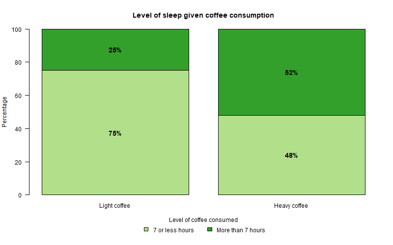
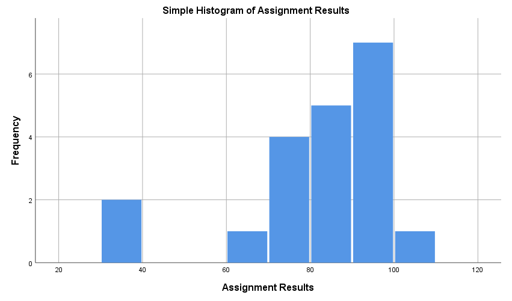
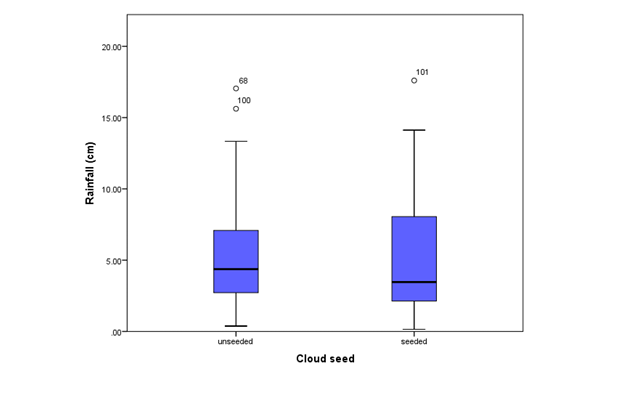

# Solutions

## Module 1

### Question 1

*Is there an association between the amount of coffee consumed and the number of hours of sleep students manage to have per night?*

The following data was collected and organized into the Contingency Table (two-way table) below to see if there is an association between amount of coffee consumed
(stated as *3 or less coffees per day (Light)* and *more than 3 coffees per day (Heavy)*) and the number of hours slept per night (stated as *7 or less hours per night* and *more than 7 hours per night*) for 151 statistics students.

Table: Coffee consumption and hours of sleep

|                          | 7 hours or less per night | More than 7 hours per night | Total |
|--------------------------|---------------------------|------------------------------|-------|
| 3 or less coffees per day (Light) | 57 | 19 | 76 |
| More than 3 coffees per day (Heavy) | 36 | 39 | 75 |
| Total 

a) From the data in the study,

i. how many students slept 7 or less hours per night?<br>
<span class="blue">93 students</span>

ii. how many students are light coffee drinkers?<br>
<span class="blue">76 students</span>

iii. how many students are heavy coffee drinkers AND sleep 7 or less hours per night?
<span class="blue">36 students</span>

b) From the data in the study,

i. what percentage of students slept 7 or less hours per night?<br>
<span class="blue">Marginal %: 93/151*100=61.59%</span>

ii. what percentage of students are light coffee drinkers?<br>
<span class="blue">Marginal %: 76/151*100=50.33%</span>

iii. what percentage of students are heavy coffee drinkers AND sleep 7 or less hours per night?<br>
<span class="blue">Joint %: 36/151*100=23.84%</span>

iv. what percentage of students who are light coffee drinkers also sleep 7 or less hours per night?<br>
<span class="blue">Conditional %: 57/76*100=75.00%</span>

v. what percentage of students who sleep 7 or less hours per night are light coffee drinkers?<br>
<span class="blue">Conditional %: 57/93*100=61.29%</span>

c) In a two-way table, display the joint distribution of level of coffee consumed and level of sleep in terms of percentages.<br>
<span class="blue">Joint distribution means that we divide each cell frequency by the total number of cases included in the whole study (n=151).</span>

|                          | 7 hours or less per night | More than 7 hours per night | Total |
|--------------------------|---------------------------|------------------------------|-------|
| 3 or less coffees per day (Light) | 57/151 = 37.75% | 19/151 = 12.58% | |
| More than 3 coffees per day (Heavy) | 36/151 = 23.84% | 39/151 = 25.83% | |
| Total | | | 100% |

d) Using the joint distribution in (c), write 4 sentences describing what each of these 4 percentages mean (i.e. one of the sentences could be something like "90% of statistics students are light coffee drinkers and have 7 or less hours of sleep per night").

<span class="blue">
- 37.75% of statistics students drink 3 or less cups of coffee per day and have 7 or less hours of sleep per night.
- Of the 151 statistics students, 12.58% sleep more than 7 hours per night and drink 3 or less cups of coffee per day.
- 23.84% of statistics students have 7 or less hours of sleep per night and drink more than 3 cups of coffee per day.
- Of the 151 statistics students, 25.83% drink more than 3 cups of coffee per day and sleep more than 7 hours per night.
</span>

e) Calculate, in percentages, and display, in a two-way table the following marginal distributions:

i. Marginal Distribution of Level of Sleep
ii. Marginal Distribution of Level of Coffee Consumed

<span class="blue">**Marginal Distribution** means we divide the row and column totals by the total number of cases included in the whole study (n=151).</span>

|                          | 7 hours or less per night | More than 7 hours per night | Total |
|--------------------------|---------------------------|------------------------------|-------|
| 3 or less coffees per day (Light) | | | 76/151 = 50.33% |
| More than 3 coffees per day (Heavy) | | | 75/151 = 49.67% |
| Total | 93/151 = 61.59% | 58/151 = 38.41% | 100% |

<span class="blue">
From the table above:

**Marginal Distribution of Level of Sleep**<br>
7 or less hours = 61.59%<br>
More than 7 hours = 38.41%

**Marginal Distribution of Level of Coffee Consumed**<br>
Light = 50.33%<br>
Heavy = 49.67%
</span>

f) Using percentages,

i. calculate the distributions of level of coffee consumed conditional on level of sleep (i.e. calculate the distribution of level of coffee consumed for those who sleep 7 or less hours and then the distribution of level of coffee consumed for those who sleep more than 7 hours).<br>
<span class="blue">**Conditional Distributions** mean we need to divide each cell frequency by the total of the conditional variable category - in this case the category for each level of sleep is the conditional variable.</span>

|                | 7 or less hours | More than 7 hours |
|----------------|------------------|---------------------|
| Light | 57/93 = 61.29% | 19/58 = 32.76% |
| Heavy | 36/93 = 38.71% | 39/58 = 67.24% |
| Total | 93/93 = 100% | 58/58 = 100% |

ii. calculate the distributions of level of sleep conditional on level of coffee consumed.<br>
<span class="blue">In this case the category for each level of Coffee Consumed is the conditional variable.</span>

|                | 7 or less hours | More than 7 hours | Total |
|----------------|------------------|---------------------|-------|
| Light | 57/76 = 75% | 19/76 = 25% | 76/76 = 100% |
| Heavy | 36/75 = 48% | 39/75 = 52% | 75/75 = 100% |

iii. Sketch a suitable graph to display the association between the two variables, using the information from (i) (there are two ways of doing this, either using the information from your answer to f(i) or the information from your answer to f(ii)).

<span class="blue">Based on the results from f(ii):</span>

<div class="figure" style="text-align: center">

<p class="caption">(\#fig:q1f-stacked-bar)Conditional distribution of % level of sleep for coffee drinkers.</p>
</div>

<span class="blue">Or, based on the results from f(i):</span>

<div class="figure" style="text-align: center">

<p class="caption">(\#fig:q1f-stacked-bar-alt)Conditional distribution of % level of coffee consumed for level of sleep categories.</p>
</div>

g) \*We used two categorical variables in this exercise and have examined the joint, marginal and conditional distributions. Based on this analysis so far (including your graph from part (f)), do you think there is an association between level of sleep and level of coffee consumed? Why or why not?

<span class="blue">
Yes, there does appear to be an association between level of sleep and level of coffee consumed. When you look at the first conditional distribution table (Conditional Distributions of level of coffee consumed for each level of sleep), for example, you can see that 38.71% of light sleepers (sleeping 7 or less hours) are heavy coffee drinkers whereas 67.24% of heavy sleepers (sleeping more than 7 hours) are heavy coffee drinkers. These are very different percentages which indicates an association between level of sleep and level of coffee consumed (it matters what level of sleep a person acquires as to how likely they are to be a heavy coffee drinker). Those students who sleep more than 7 hours per night are more likely to be heavy coffee drinkers than those who sleep less than 7 hours per night.

Ideas to think about:

- Does this result make sense? You would think that the more coffee you consumed the less you would sleep.
- Maybe the sample we took was not representative of all students.
</span>

::: {.tipBox}
**Note on wording**:

- Saying that two categorical variables are **not associated** (or not related) is the same as saying they are **independent**.
- Saying that two categorical variables are **associated** (or related) is the same as saying they are **NOT independent**.
:::

### Question 2: Repeat Q1 using Statistical Software

Using the data in Question 1, repeat the analysis using Statistical Software for this course and then compare your answers in Question 1 with your output.

a) Open the datafile Tutorial 1 in your Statistical Software (this file can be found in the Module 1 block on the StudyDesk, or downloaded from here). Alternatively, you can enter the summarised data yourself using the Weight Cases method shown in the accompanying video.

b) Make sure the Variable View is set up correctly.<br>
<span class="blue">Note: this step is not applicable for Excel, as there is no Variable View.</span>

c) Create a two-way table showing the frequencies and totals. Put Coffee Consumed in rows and Level of Sleep in columns.

|                | 7 or less hours | More than 7 hours | Total |
|----------------|------------------|---------------------|-------|
| Light | 57 | 19 | 76 |
| Heavy | 36 | 39 | 75 |
| Total | 93 | 58 | 151 |

d) \*Display the joint distribution of level of coffee consumed and level of sleep in terms of percentages, in a two-way table. Note that this table also gives you the marginal distributions. Compare with answers in Q1.

|                | 7 or less hours | More than 7 hours | Total |
|----------------|------------------|---------------------|-------|
| Light - Count | 57 | 19 | 76 |
| Light - % of Total | 37.7% | 12.6% | 50.3% |
| Heavy - Count | 36 | 39 | 75 |
| Heavy - % of Total | 23.8% | 25.8% | 49.7% |
| Total - Count | 93 | 58 | 151 |
| Total - % of Total | 61.6% | 38.4% | 100.0% |

e) \*Produce the conditional distributions (both Row Percent and Column Percent). Compare with answers in Q1.

<span class="blue">The **Column Percent** gives % conditional on Level of Sleep, equivalent to Q1(f)(i):</span>

|                | 7 or less hours | More than 7 hours | Total |
|----------------|------------------|---------------------|-------|
| Light - Count | 57 | 19 | 76 |
| Light - % within Level of Sleep | 61.3% | 32.8% | 50.3% |
| Heavy - Count | 36 | 39 | 75 |
| Heavy - % within Level of Sleep | 38.7% | 67.2% | 49.7% |
| Total - Count | 93 | 58 | 151 |
| Total - % within Level of Sleep | 100.0% | 100.0% | 100.0% |

<span class="blue">The **Row Percent** gives % conditional on Coffee Consumed, equivalent to Q1(f)(ii):</span>

|                | 7 or less hours | More than 7 hours | Total |
|----------------|------------------|---------------------|-------|
| Light - Count | 57 | 19 | 76 |
| Light - % within Coffee Consumed | 75.0% | 25.0% | 100.0% |
| Heavy - Count | 36 | 39 | 75 |
| Heavy - % within Coffee Consumed | 48.0% | 52.0% | 100.0% |
| Total - Count | 93 | 58 | 151 |
| Total - % within Coffee Consumed | 61.6% | 38.4% | 100.0% |

f) \*Construct a Stacked Bar Graph to display the association between level of coffee consumed and level of sleep and compare to your sketch in Question 1(f)(iii).<br>
<span class="blue">See the graphs above in Question 1(f)(iii) - your software output should match one of these two stacked bar graphs.</span>

<!-- ## Module 2 -->

<!-- ### Question 1: Describing Distributions -->

<!-- a) Construct a stem-and-leaf display of the following data: -->

<!-- 2.73, 2.79, 2.85, 2.85, 2.53, 2.37, 2.61, 2.67, 2.78, 2.65, 2.84, 2.69, 2.72, 2.63, 2.68 -->

<!-- <span class="blue"> -->
<!-- ``` -->
<!-- 2.3 | 7 -->
<!-- 2.4 | -->
<!-- 2.5 | 3 -->
<!-- 2.6 | 1 3 5 7 8 9 -->
<!-- 2.7 | 2 3 8 9 -->
<!-- 2.8 | 4 5 5 -->
<!-- ``` -->
<!-- 2.3\|7 = 2.37, where the stem includes the first decimal place (0.1 increments) and each leaf is one case representing the second decimal place (0.01 increments). -->
<!-- </span> -->

<!-- b) Describe the distribution in terms of shape, centre, spread and outliers. -->

<!-- <span class="blue"> -->
<!-- - **Shape:** skewed to the left, unimodal (peak at the 2.6 mark) -->
<!-- - **Centre:** approximately 2.6-2.7 -->
<!-- - **Spread:** from 2.37 to 2.85 -->
<!-- - **Outliers:** there is a "gap" in the distribution between 2.53 and 2.37. This could also be interpreted as a continuation of the left skew, or perhaps 2.37 is a possible outlier. If we conclude that 2.37 is an outlier, then the spread would be 2.53 to 2.85. Because the sample is small it is difficult to reach a firm conclusion, but it is good that we are aware that 2.37 might be a bit odd in our sample. -->
<!-- </span> -->

<!-- ### Question 2: Assignment Results -->

<!-- The following represent the assignment results (out of 100) for a class of 20 statistics students: -->

<!-- 85, 38, 92, 93, 100, 88, 78, 79, 96, 81, 62, 39, 77, 78, 83, 91, 90, 85, 99, 97 -->

<!-- ```{r mod2-q2-hist-solution, echo=FALSE, fig.cap="Histogram of Statistics Class Assignment Results.", out.width="80%", fig.align="center"} -->
<!--  -->
<!-- ``` -->

<!-- For this data and the figure above, complete the following questions: -->

<!-- a) Describe the distribution of Assignment Results in terms of shape, centre, spread and outliers (including how many student results could be considered to be outliers). -->

<!-- <span class="blue"> -->
<!-- - **Shape:** skewed to the left, unimodal (peak at the 90 mark) -->
<!-- - **Centre:** approximately 80-89 marks -->
<!-- - **Spread:** from 62 to 100 marks -->
<!-- - **Outliers:** There is one bin that represents potential outliers, but there are two cases in this bin (check frequency on the y-axis). We would state there are 2 outliers at 38 and 39 marks, however you may have stated that this is a continuation of the skew. If you said there were no outliers, then your spread would be from 38 to 100 marks. -->
<!-- </span> -->

<!-- b) What centre and spread would you use to describe this distribution? Why?<br> -->
<!-- <span class="blue">As there is a skew (and outliers) it is probably best to use the median for the centre and the IQR for the spread. This is because skewness or outliers affect the mean and standard deviation and not the median and IQR.</span> -->

<!-- c) Using a computer or calculator, calculate the mean of the data set.<br> -->
<!-- <span class="blue">Mean = 81.55 marks</span> -->

<!-- d) Using a computer or calculator, calculate the standard deviation of the data set.<br> -->
<!-- <span class="blue">Standard Deviation = 17.33 marks</span> -->

<!-- e) Calculate the median of the data set (using both software and by hand).<br> -->
<!-- <span class="blue"> -->
<!-- First put the numbers in order:<br> -->
<!-- 38 39 62 77 78 78 79 81 83 85 85 88 90 91 92 93 96 97 99 100<br> -->
<!-- Median = the middle value once the numbers are sorted. Because we have an even number of values (n=20) we take the average of the 10th and 11th values: (85+85)/2 = 85 marks.<br> -->
<!-- This can also be written as the (n+1)/2 th position = 21/2 = 10.5th position = (85+85)/2 = 85 marks.<br> -->
<!-- If we had an odd number of values the median would be the value of the single case in the middle position. -->
<!-- </span> -->

<!-- f) Why are the mean and median different/similar?<br> -->
<!-- <span class="blue">They are not very different; however, the difference is due to the skewness and outliers which in this case "pull" the mean to the left a bit, making the mean a bit lower (81.55 marks) than the median (85 marks). The way the mean is calculated means that when the distribution is skewed left the mean will be smaller than the median, and when the distribution is skewed right the mean will be larger than the median.</span> -->

<!-- g) Reproduce these results (graph and descriptive statistics) using a statistical software package.<br> -->
<!-- <span class="blue"> -->
<!-- You will need to enter the 20 values into your software and set up the Variable View (where applicable). To reproduce the histogram, use the chart/graph builder to create a simple histogram with Assignment Results on the x-axis. -->

<!-- Selected descriptive statistics from software: -->

<!-- | Statistic | Value | -->
<!-- |-----------|-------| -->
<!-- | Mean | 81.55 | -->
<!-- | Median | 85.00 | -->
<!-- | Std. Deviation | 17.325 | -->
<!-- | Variance | 300.155 | -->
<!-- | Minimum | 38 | -->
<!-- | Maximum | 100 | -->
<!-- | Range | 62 | -->
<!-- | Interquartile Range | 15 | -->
<!-- | Skewness | -1.626 | -->

<!-- Note: software calculates Q1 and Q3 a bit differently than when completing by hand - for all assessment items, please use the by-hand method described below. Tukey's Hinges (Q1 = 78, Q3 = 92.5) give the same values as the hand calculations. -->
<!-- </span> -->

<!-- h) What 5 numbers make up the five-number summary?<br> -->
<!-- <span class="blue">Minimum, Q1, Median, Q3, Maximum</span> -->

<!-- i) \*Calculate Q1 and Q3 of the data set by hand and then fill in the numbers of the five-number summary. -->

<!-- <span class="blue"> -->
<!-- - **Minimum:** 38 marks -->
<!-- - **Q1:** We only consider the lower half (lower 50%, or first 10 values) of the data, and the middle value is the average of the 5th and 6th values = (78+78)/2 = 78 marks -->
<!-- - **Median:** 85 marks (as calculated in part (e)) -->
<!-- - **Q3:** We only consider the upper half (upper 50%, or last 10 values) of the data, and the middle value is the average of the 15th and 16th values = (92+93)/2 = 92.5 marks -->
<!-- - **Maximum:** 100 marks -->
<!-- </span> -->

<!-- j) \*Calculate the IQR of the data set by hand.<br> -->
<!-- <span class="blue">IQR = Q3 - Q1 = 92.5 - 78 = 14.5 marks<br> -->
<!-- Note: software gives this as 15, because it calculates Q1 and Q3 a bit differently.</span> -->

<!-- ### Question 3: Cloud Seeding in Tasmania -->

<!-- An experiment was carried out in Tasmania, Australia between 1964 and 1971 to ascertain the effectiveness of cloud-seeding to promote rain [1]. Some of the data from this experiment are displayed in Figure 2.2. Compare in fewer than 75 words, the distributions of rainfall from the seeded and unseeded clouds. You should mention shape, centre, spread, and outliers in your discussion. -->

<!-- [1] (Miller, A.J. et al (1979) 'Analyzing the results of a cloud-seeding experiment in Tasmania', *Communications in Statistics-Theory & Methods* **A8**(10),1017-1047) -->

<!-- ```{r mod2-q3-boxplot-solution, echo=FALSE, fig.cap="Side by side boxplots of rainfall data.", out.width="80%", fig.align="center"} -->
<!--  -->
<!-- ``` -->

<!-- <span class="blue">Both groups are skewed right (positive) with some outliers. Both groups seem to have similar shapes although the middle 50% of cases in the seed group cover a wider range (~2.5 - 7.5) than the unseeded group (~3.0 - 6.0) and the median of the seeded group is a bit lower than the unseeded group. Excluding the outliers, the distributions are both still fairly skewed.</span> -->


